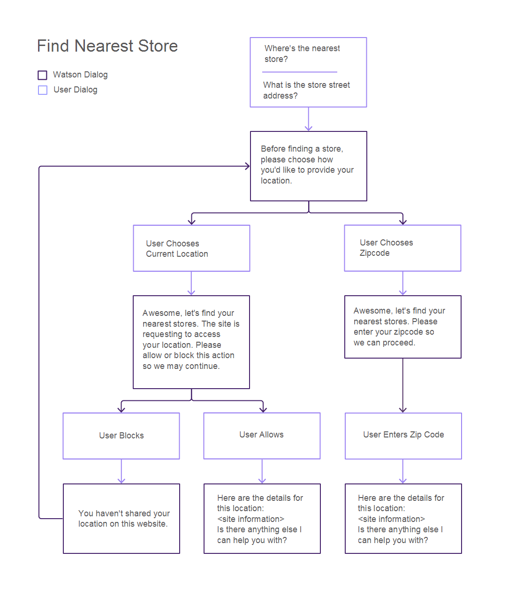
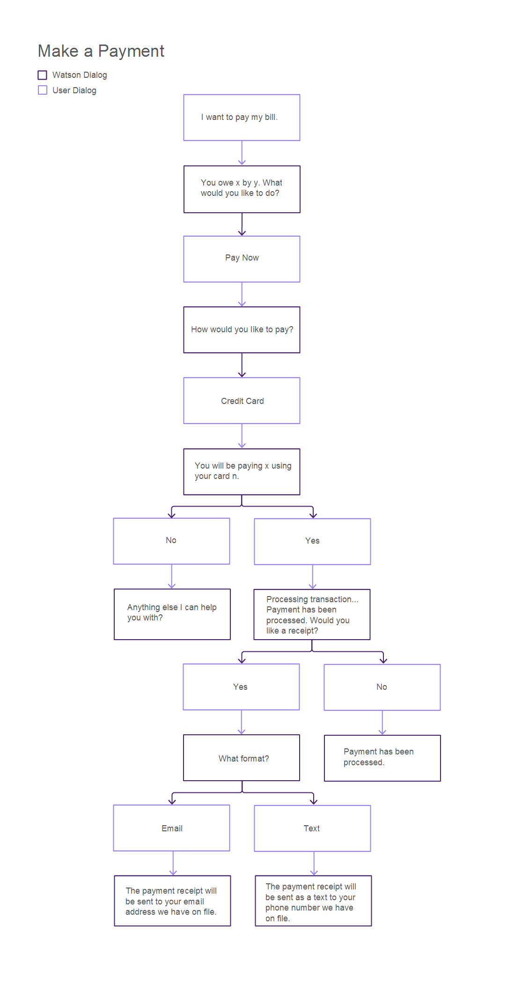
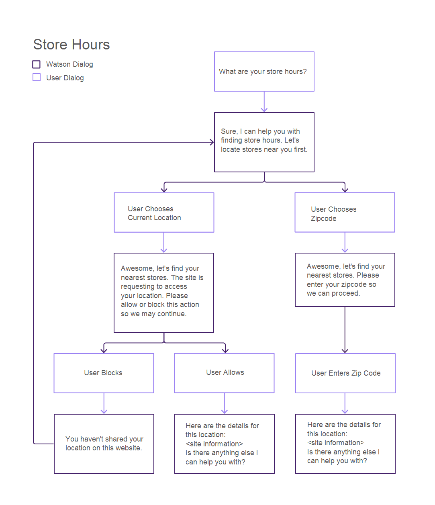
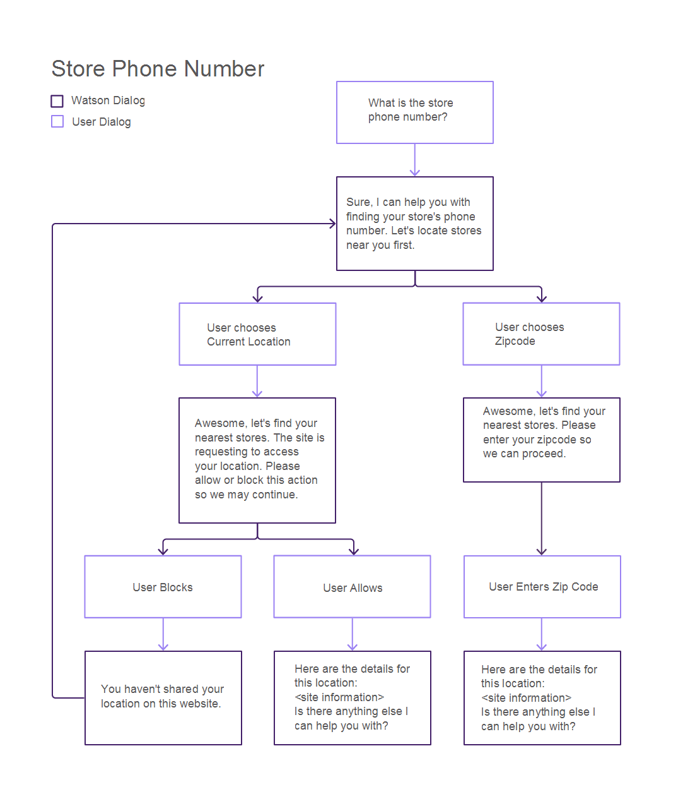

---

copyright:
  years: 2015, 2017
lastupdated: "2017-08-01"

---

{:shortdesc: .shortdesc}
{:new_window: target="_blank"}
{:tip: .tip}
{:pre: .pre}
{:codeblock: .codeblock}
{:screen: .screen}
{:javascript: .ph data-hd-programlang='javascript'}
{:java: .ph data-hd-programlang='java'}
{:python: .ph data-hd-programlang='python'}
{:swift: .ph data-hd-programlang='swift'}

# Configuring core capabilities
{: #configure}

To configure the bot, you must choose the capabilities that you want it to have.
{: shortdesc}

A capability is the ability of your virtual agent to recognize and satisfy a specific customer goal. See [Capabilities](how-it-works.html#capabilities) for more details.

To use a core capability, simply specify how you want the agent to behave when enacting the capability. For some capabilities, returning a predefined text response to a user inquiry might be sufficient. Others might require a complex conversation flow in order to gather information that is required to perform a transaction, in which case the agent collects and passes information to your application, which must implement the required business processes.

By default, all core capabilities are enabled and have canned responses. You must first decide whether to disable any capabilities that your agent doesn't need. For capabilities that you want to keep, you must replace the canned responses with responses that reflect information about your business.

To configure a core capability, complete the following steps:

1.  Open the **Capabilities** page to see a list of capabilities grouped by category that are supported by the current agent.

1.  Review the capabilities, and decide which ones you want your bot to support. All of the capabilities are enabled unless you turn them off.

    Click the switch to turn a capability on or off. To disable all of the capabilities in a category, click the **More** menu   on the category tile, and then select **Turn All Off**.

    Alternatively, for a capability that you have no intention of supporting, but suspect a customer might ask about, you can choose to keep the capability enabled and provide a text response for it that explains that you do not support it. For example, if you do not offer insurance, rather than disabling the **Add insurance** capability, you could enable it. For a response type, choose **Text**. In the associated **Message** field, add *We do not offer insurance for our products*.

1.  To configure a capability, click the capability name.

1.  Choose the type of response to display to the user when this capability is triggered. These are the options:

    

    - **Text**

        For simple inquiries, you can use the configuration tool to specify a standard textual response to be displayed to the user. This response type is useful for queries that have simple answers and do not require gathering additional information or any interaction with other systems. For example, for the Method Of Payment Inquiry intent, you might specify the text response `We accept all major credit cards`.

        If you select the **Text** response type, you must also specify the text of the response.

    - **Built-in**

        A set of capabilities come with prebuilt dialogs that collect additional information or implement complex handling. A *dialog* provides the structure for a conversation with the user. See [Built-in dialogs](configure.html#builtin_dialog_ovw) to learn more about which capabilities support this response type, and how the conversation flows when implemented.

        If you select the **Built-in** response type, you might also need to configure additional data that the dialog uses to present choices to the user (such as store locations or payment methods). In many cases, your application must listen for events that can be triggered by the dialog and implement actions in your systems of record. See [Implementing logic to support built-in conversation](impl_intents.html#backend_transaction) for more details.

    - **Use your own conversation**

        If you need to implement complex customer interactions for a capability, you can build your own dialog that shapes the agent's conversation with the customer. This option requires additional steps that involve building a custom dialog with the {{site.data.keyword.watson}} {{site.data.keyword.conversationshort}} service and linking it to the agent. See [Building a custom dialog](add-custom-dialog.html) for more details.

    - **Transfer to human agent**

        For any capability that you do not want to handle using the virtual agent, you can specify that you want an event to be triggered that requests a human agent. Your application can then respond to this event using your processes for initiating a chat session with a human customer service representative.

        If you select the **Transfer to human agent** response type, you can specify a message that provides context for the customer request to be passed to the human agent also.

1.  Click **Save** to save your choice. Make any additional changes that are required based on the response type and save them.

    You can click the back arrow next to the capability name to return to the main Capabilities page.

## Built-in dialogs
{: #builtin_dialog_ovw}

The following sections describe the core capabilities that the built-in conversation flows are trained to recognize and react to. These built-in dialogs are provided with all of the capability packs.

### Find nearest store
{: #builtin_dialog_ovw__findNearestStore}

The following diagram shows the nodes in the built-in conversation for the *Find nearest store* capability. The same dialog flow is used for this capability and the *Store location* capability.

The only additional step required by you is to add store location details for every store. You can add the store details from one of the following capabilities that you can access from the Capabilities page:

- Find nearest store
- Store location

### Make a payment

The following diagram shows the nodes in the built-in conversation for the *Make a payment* capability.

Click [here](backend_payment_gif.html#backend_payment_gif) to see how the user input and virtual agent responses flow through the system.

First, specify the types of credit cards you accept as part of the *Make a payment* capability configuration. You can edit the capability from the Capabilities page. Then, see [Implementing logic to support built-in conversation](impl_intents.html#makeapayment) for information about additional steps you must take to fully support this capability.

### Store hours

The following diagram shows the nodes in the built-in conversation for the *Store hours* capability.

If you want to provide store hours, then you must include the business hours information when you add the store location information through the following capabilities:

- Find nearest store
- Store location

### Store location

See the diagram above to see the nodes in the built-in conversation for the *Store location* capability. The same dialog flow is used for this capability and the [Find nearest store](configure.html#builtin_dialog_ovw__findNearestStore) capability.

The only additional step required by you is to add store location details for every store. You can add the store details from one of the following capabilities that you can access from the Capabilities page:

- Find nearest store
- Store location

### Store phone number

The following diagram shows the nodes in the built-in conversation for the *Store phone number* capability.

If you want to provide store phone numbers, then you must add them to the store location definitions that you add through the following capabilities:

- Find nearest store
- Store location

### Update address

The following diagram shows the nodes in the built-in conversation for the *Update address* capability.

See [Implementing logic to support built-in conversation](impl_intents.html#updateaddress) for information about additional steps you must take to fully support this capability.

### Update contact phone number

The following diagram shows the nodes in the built-in conversation for the *Update contact phone number* capability.

See [Implementing logic to support built-in conversation](impl_intents.html#updatephone) for information about additional steps you must take to fully support this capability.

### Update email

The following diagram shows the nodes in the built-in conversation for the *Update email* capability.

See [Implementing logic to support built-in conversation](impl_intents.html#updateemail) for information about additional steps you must take to fully support this capability.
