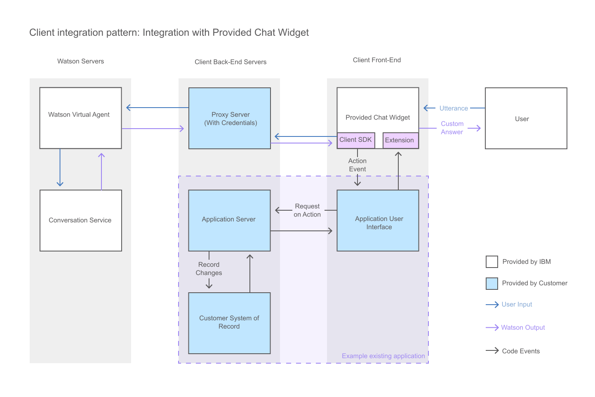

---

copyright:
  years: 2015, 2017
lastupdated: "2017-08-01"

---

{:shortdesc: .shortdesc}
{:new_window: target="_blank"}
{:tip: .tip}
{:pre: .pre}
{:codeblock: .codeblock}
{:screen: .screen}
{:javascript: .ph data-hd-programlang='javascript'}
{:java: .ph data-hd-programlang='java'}
{:python: .ph data-hd-programlang='python'}
{:swift: .ph data-hd-programlang='swift'}

# Adding the provided chat widget to your UI
{: #integrate_add-chat}

The {{site.data.keyword.watson}} {{site.data.keyword.virtualagentshort}} comes with a chat widget that you can use as-is in your user interface.
{: shortdesc}

This diagram illustrates how the conversation flows through the system when you use the chat widget that is provided by {{site.data.keyword.IBM_notm}}.

1.  To use the provided widget, open the [{{site.data.keyword.watson}} {{site.data.keyword.virtualagentshort}} Chat Widget ](https://github.com/watson-virtual-agents/chat-widget){: new_window} GitHub repository, and complete the steps in the `README.md` file.

    The provided chat widget is extensible. If it contains elements that you want to change, you can customize them. For example, to change a layout that is used by the provided chat widget, you can write a custom layout that overrides it. See the example here: [https://github.com/watson-virtual-agents/chat-widget/tree/1.2.12/examples/basic-custom-layout. ](https://github.com/watson-virtual-agents/chat-widget/tree/1.2.12/examples/basic-custom-layout){: new_window} Keep in mind that the layout might be used by more than one intent.

1.  For information about steps you must take to support chat widget transactions that can occur for capabilities that use the built-in conversation, see [Implementing logic to support built-in conversation](impl_intents.html#backend_transaction).

If the extent of customizations that you want to make is so pervasive that it is impossible to implement your changes by making updates to the provided chat widget, then you can create your own chat interface. See [Building a custom chat interface](integrate_custom-chat.html).
