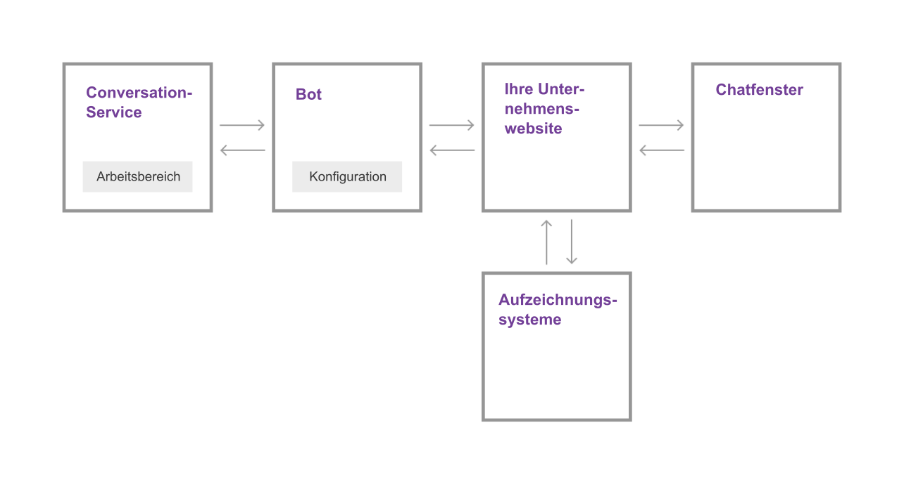

---

copyright:
  years: 2015, 2017
lastupdated: "2017-08-01"

---

{:shortdesc: .shortdesc}
{:new_window: target="_blank"}
{:tip: .tip}
{:pre: .pre}
{:codeblock: .codeblock}
{:screen: .screen}
{:javascript: .ph data-hd-programlang='javascript'}
{:java: .ph data-hd-programlang='java'}
{:python: .ph data-hd-programlang='python'}
{:swift: .ph data-hd-programlang='swift'}

# Übersicht
{: #about}

{{site.data.keyword.virtualagentfull}} setzt sich aus einer Reihe vorkonfigurierter kognitiver Komponenten zusammen, die auf dem {{site.data.keyword.IBM_notm}} {{site.data.keyword.watson}} {{site.data.keyword.conversationshort}}-Service basieren. Durch die Konfiguration des virtuellen Agenten mit den Informationen Ihres Unternehmens können Sie ohne großen Aufwand einen automatisierten Chat-Bot implementieren, der mit Ihren Kunden kommuniziert, um ihnen bei der Erreichung ihrer Ziele zu helfen.
{: shortdesc}

{{site.data.keyword.watson}}&trade; {{site.data.keyword.virtualagentshort}} stellt folgende Komponenten bereit:

- Ein Konfigurationstool, mit dem Sie konfigurieren können, wie der Bot auf verschiedene Anforderungstypen reagieren soll.
- Eine Reihe von Funktionen, die allgemeine Ziele darstellen oder Aktionen, die Kunden normalerweise durchführen möchten (z. B. \"Rechnung zahlen\" oder \"Teilen Sie mir Ihre Geschäftszeiten mit\").
- Ein natürlichsprachliches Modell, das trainiert wurde, um basierend auf der Kundeneingabe Absichten zu ermitteln.
- Einen Konversationsdialogfluss, der einige komplexe Anforderungen bearbeiten kann, indem zur Eingabe zusätzlicher Informationen aufgefordert wird, Antworten generiert werden und von Ihrer Anwendung zu bearbeitende Ereignisse ausgelöst werden. Wenn der vordefinierte Dialog Ihre Anforderungen nicht erfüllt, können Sie mit den Tools des {{site.data.keyword.watson}} {{site.data.keyword.conversationshort}}-Service Ihren eigenen benutzerdefinierten Dialog implementieren.
- Einen Mechanismus zur Erweiterung der Funktionen des Agenten durch benutzerdefinierte Funktionen, die Sie in einem {{site.data.keyword.conversationshort}}-Arbeitsbereich definieren und mit dem Agenten verknüpfen.
- Ein Chat-Widget, das Sie auf Ihrer Webseite integrieren können, und ein SDK, mit dem Sie ein benutzerdefiniertes Chat-Widget entwickeln können.
- Eine Reihe von APIs, die Sie für die Integration Ihrer Anwendung in den virtuellen Agenten verwenden können.

## Architekturübersicht
{: #arch_overview}

Das folgende Diagramm veranschaulicht die Architektur einer typischen {{site.data.keyword.watson}} {{site.data.keyword.virtualagentshort}}-Implementierung:

Die Implementierung umfasst folgende Hauptkomponenten:

- **{{site.data.keyword.conversationshort}}-Service**

    Eine Instanz des {{site.data.keyword.watson}} {{site.data.keyword.conversationshort}}-Service. Der {{site.data.keyword.conversationshort}}-Service stellt die Artefakte für Funktionen bereit: die Absichten, Entitäten und den Dialogfluss zusammen mit der zugrunde liegenden kognitiven Verarbeitung, über die die Funktionen des Chat-Bots angetrieben werden. Wenn Sie nur einen benutzerdefinierten Dialog oder eine benutzerdefinierte Funktion implementieren möchten, interagieren Sie direkt mit dem {{site.data.keyword.conversationshort}}-Arbeitsbereich.

    Weitere Informationen zu Absichten und Dialogen finden Sie in der [Dokumentation zum {{site.data.keyword.conversationshort}}-Service ](https://console.bluemix.net/docs/services/conversation/index.html#about){: new_window}.

- **Bot**

    Ein auf dem {{site.data.keyword.conversationshort}}-Service basierender Bot, einschließlich einer Reihe von Funktionen. Der Bot ist so trainiert, dass er Benutzeranfragen zum Kundenprojekt erkennen kann, wie z. B. Anforderungen für grundlegende Unternehmensinformationen und die Zahlung von Rechnungen. Mit dem bereitgestellten Bot-Konfigurationstool können Sie unternehmensspezifische Informationen, die als Antwort auf Benutzeranfragen angegeben werden können, und die Antwort für die einzelnen Funktionen konfigurieren.

- **Ihre Unternehmenswebsite**

    Ihre kundenorientierte Geschäftsanwendung, die die Kommunikation mit dem {{site.data.keyword.watson}} {{site.data.keyword.virtualagentshort}}-Bot und Ihren Datenbeständen (z. B. Kundendatenbanken oder Abrechnungssysteme) handhabt.

- **Chatfenster**

    Die Chat-Schnittstelle des virtuellen Agenten, über die Kunden mit dem Bot kommunizieren. Sie können das bereitgestellte Chat-Widget verwenden (angepasst oder nicht angepasst) oder Sie können mithilfe des Client-SDK Ihr eigenes Chat-Widget implementieren.
