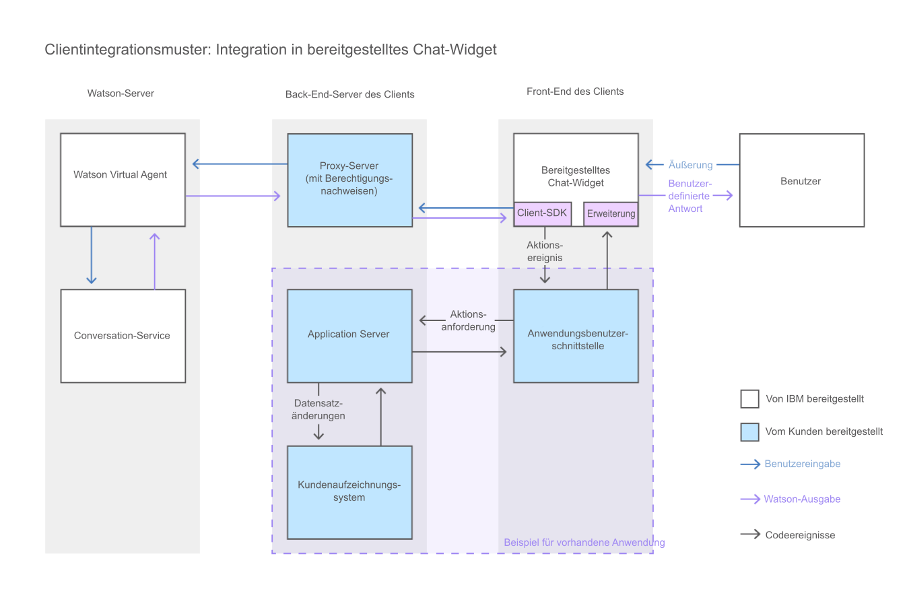
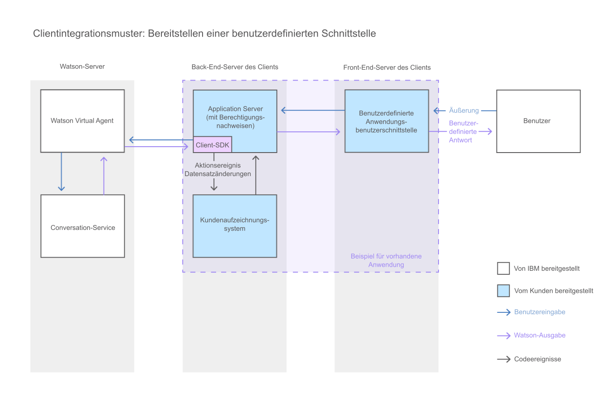

---

copyright:
  years: 2015, 2017
lastupdated: "2017-08-01"

---

{:shortdesc: .shortdesc}
{:new_window: target="_blank"}
{:tip: .tip}
{:pre: .pre}
{:codeblock: .codeblock}
{:screen: .screen}
{:javascript: .ph data-hd-programlang='javascript'}
{:java: .ph data-hd-programlang='java'}
{:python: .ph data-hd-programlang='python'}
{:swift: .ph data-hd-programlang='swift'}

# Integrieren des Agenten in Ihre Anwendungsbenutzerschnittstelle
{: #integrate}

Zum Integrieren des Front-End-Clients von {{site.data.keyword.watson}} {{site.data.keyword.virtualagentshort}} in Ihre Anwendung können Sie die von {{site.data.keyword.IBM_notm}} bereitgestellte Chat-Schnittstelle unverändert zu Ihrer Website für Kunden hinzufügen, das bereitgestellte Chatfenster einblenden, um es Ihren Bedürfnissen entsprechend anzupassen, oder Ihre eigene Chat-Schnittstelle erstellen.
{: shortdesc}

[Hinzufügen des bereitgestellten Chat-Widgets zu Ihrer Benutzerschnittstelle](/docs/services/virtual-agent/integrate.html#add_chat)

[Erstellen einer benutzerdefinierten Chat-Schnittstelle](/docs/services/virtual-agent/integrate.html#custom_chat)

## Hinzufügen des bereitgestellten Chat-Widgets zu Ihrer Benutzerschnittstelle
{: #add_chat}

Im Lieferumfang von {{site.data.keyword.watson}} {{site.data.keyword.virtualagentshort}} ist ein Chat-Widget enthalten, das Sie unverändert in Ihrer Benutzerschnittstelle verwenden können.

### Informationen zu dieser Aufgabe

Dieses Diagramm veranschaulicht, wie die Konversation durch das System fließt, wenn Sie das von {{site.data.keyword.IBM_notm}} bereitgestellte Chat-Widget verwenden.

### Verfahren

1. Öffnen Sie für die Verwendung des bereitgestellten Widgets das [Chat-Widget von {{site.data.keyword.watson}} {{site.data.keyword.virtualagentshort}} ](https://github.com/watson-virtual-agents/chat-widget){: new_window} GitHub-Repository und führen Sie die Schritte in der Datei `README.md` aus.

    Das bereitgestellte Chat-Widget kann erweitert werden. Wenn es Elemente enthält, die Sie ändern möchten, können Sie diese anpassen. So können Sie beispielsweise zur Änderung eines Layouts, das im bereitgestellten Chat-Widget verwendet wird, ein benutzerdefiniertes Layout schreiben, mit dem das andere Layout überschrieben wird. Ein Beispiel finden Sie hier: [https://github.com/watson-virtual-agents/chat-widget/tree/1.2.12/examples/basic-custom-layout. ](https://github.com/watson-virtual-agents/chat-widget/tree/1.2.12/examples/basic-custom-layout){: new_window} Beachten Sie, dass das Layout von mehreren Absichten verwendet werden könnte.

1. Unter [Implementieren einer Logik zur Unterstützung einer integrierten Konversation](/docs/services/virtual-agent/impl_intents.html#backend_transaction) finden Sie Informationen zu auszuführenden Schritten für die Unterstützung von Transaktionen im Chat-Widget, die bei Funktionen auftreten können, die die integrierte Konversation verwenden.

### Weitere Schritte

Wenn der Umfang der Anpassungen, die Sie vornehmen möchten, so umfassend ist, dass eine Implementierung Ihrer Änderungen durch das Durchführen von Aktualisierungen für das bereitgestellte Chat-Widget unmöglich ist, können Sie Ihre eigene Chat-Schnittstelle erstellen.

## Erstellen einer benutzerdefinierten Chat-Schnittstelle
{: #custom_chat}

Wenn das bereitgestellte Chat-Widget Ihre Anforderungen nicht erfüllt, können Sie Ihre eigene JavaScript-Chat-Schnittstelle entwickeln, um Ihren Benutzern eine Interaktion mit dem virtuellen Agenten zu ermöglichen. Dadurch haben Sie die volle Kontrolle über das Layout, die Darstellung und das Verhalten der Chat-Schnittstelle.

### Informationen zu dieser Aufgabe

Dieses Diagramm veranschaulicht, wie die Konversation durch das System fließt, wenn Sie eine benutzerdefinierte Chat-Schnittstelle bereitstellen.

### Verfahren

Verwenden Sie für die Entwicklung einer benutzerdefinierten Chat-Schnittstelle mit JavaScript folgende Ressourcen:

- **Client-SDK von {{site.data.keyword.watson}} {{site.data.keyword.virtualagentshort}}**

    Ein JavaScript-SDK zur Entwicklung von Anwendungen, die mit {{site.data.keyword.watson}} {{site.data.keyword.virtualagentshort}} interagieren. Das Client-SDK wird im [GitHub ](https://github.com/watson-virtual-agents/client-sdk){: new_window}gehostet.

- **API-Explorer**

    Ein Portal, das den Zugriff auf die REST-APIs von {{site.data.keyword.watson}} {{site.data.keyword.virtualagentshort}} unter {{site.data.keyword.IBM_notm}} {{site.data.keyword.Bluemix_notm}} bereitstellt. Sie können über [den API-Explorer von {{site.data.keyword.IBM_notm}} developerWorks ](https://developer.ibm.com/api/view/id-339:title-Watson_Virtual_Agent){: new_window}auf die APIs von {{site.data.keyword.watson}} {{site.data.keyword.virtualagentshort}} zugreifen.

