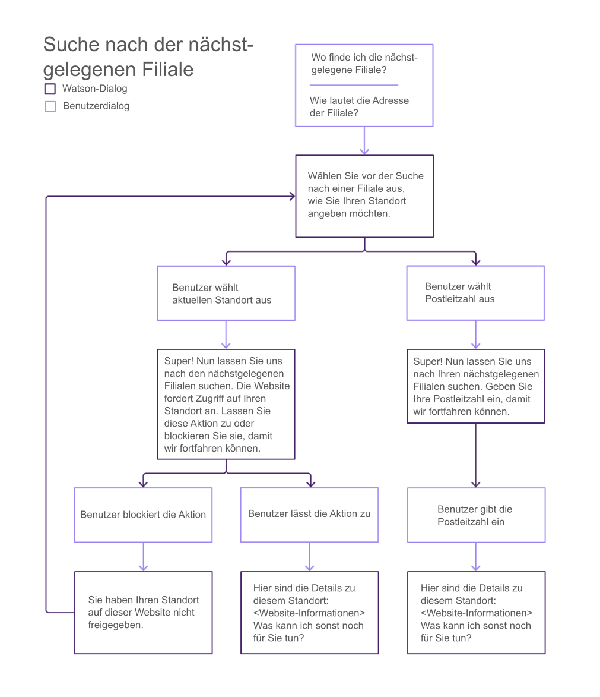
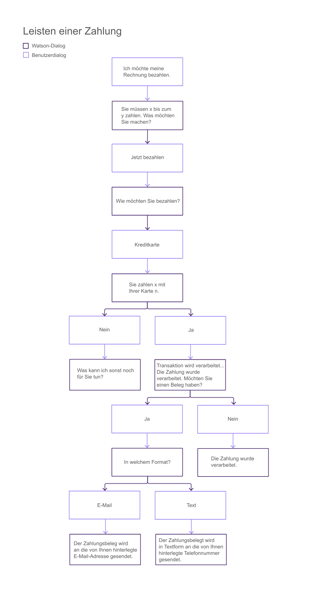
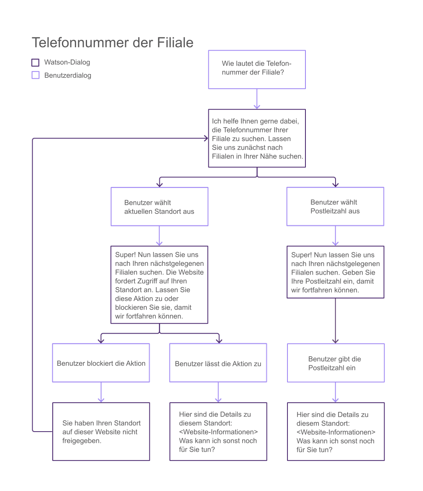
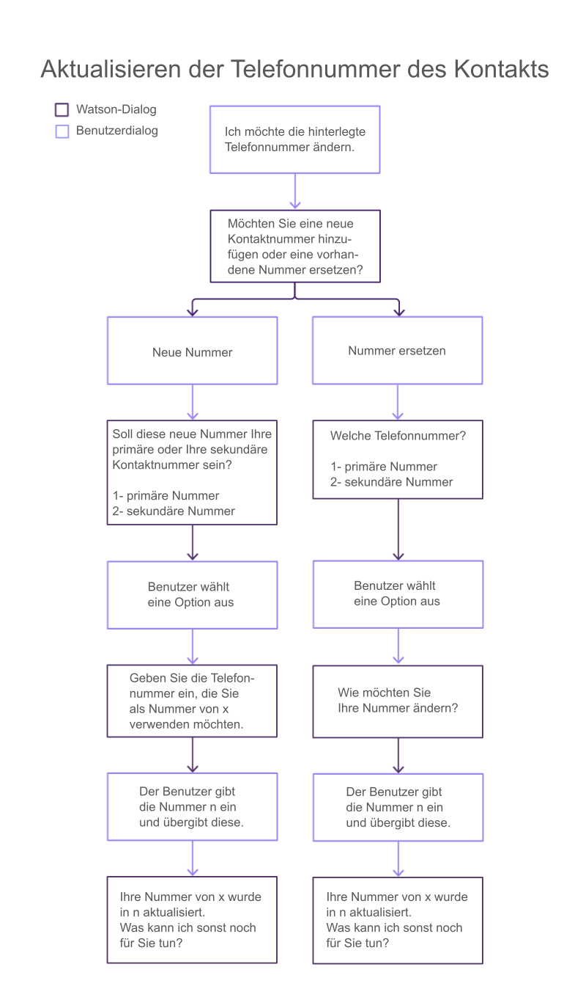

---

copyright:
  years: 2015, 2017
lastupdated: "2017-08-01"

---

{:shortdesc: .shortdesc}
{:new_window: target="_blank"}
{:tip: .tip}
{:pre: .pre}
{:codeblock: .codeblock}
{:screen: .screen}
{:javascript: .ph data-hd-programlang='javascript'}
{:java: .ph data-hd-programlang='java'}
{:python: .ph data-hd-programlang='python'}
{:swift: .ph data-hd-programlang='swift'}

# Personalisieren von Agentenantworten
{: #integrate_backend}

Bestimmen Sie, wie der Agent Kunden antworten soll. Sie können die integrierte Konversation verwenden oder eine benutzerdefinierte Konversation zur Personalisierung der Agentenantworten angeben.
{: shortdesc}

[Verwenden der integrierten Konversation](/docs/services/virtual-agent/integrate_backend.html#use_builtin)

[Verwenden Ihrer eigenen Konversation](/docs/services/virtual-agent/integrate_backend.html#use_custom)

## Verwenden der integrierten Konversation
{: #use_builtin}

{{site.data.keyword.watson}} {{site.data.keyword.virtualagentshort}} stellt für eine Reihe von allgemeinen Aufgaben integrierte Konversationsflüsse bereit, die Sie unverändert zur Vereinfachung des Prozesses verwenden können, in dem zum Durchführen einer Aufgabe Informationen von Benutzern abgerufen werden.

### Integrierte Dialoge
{: #builtin_dialog_ovw}

In den folgenden Abschnitten werden die Absichten beschrieben, bei denen die integrierten Konversationsflüsse dafür trainiert wurden, diese zu erkennen und darauf zu reagieren.

#### Nächstgelegene Filiale suchen
{: #builtin_dialog_ovw__findNearestStore}

Das folgende Diagramm zeigt die Knoten in der integrierten Konversation für die Absicht <cite class="cite">Nächstgelegene Filiale suchen</cite>. Für diese Absicht und die Absicht <cite class="cite">Filialstandort</cite> wird der gleiche Dialogfluss verwendet.



In dem einzigen zusätzlichen Schritt, der von Ihnen erforderlich ist, müssen Sie bei jeder Filiale Details zum Filialstandort hinzufügen. Sie können die Details zur Filiale über eine der folgenden Absichten hinzufügen, auf die Sie über die Seite \"Konfigurieren\" Zugriff haben:

- Nächstgelegene Filiale suchen
- Filialstandort

#### Zahlung leisten

Das folgende Diagramm zeigt die Knoten in der integrierten Konversation für die Absicht <cite class="cite">Zahlung leisten</cite>.



Klicken Sie [hier](/docs/services/virtual-agent/backend_payment_gif.html), um zu sehen, wie die Benutzereingabe und die Antworten des virtuellen Agenten durch das System fließen.

Informationen zu zusätzlichen Schritten, die Sie ausführen müssen, damit diese Absicht vollständig unterstützt wird, finden Sie unter [Implementieren einer Logik zur Unterstützung einer integrierten Konversation](/docs/services/virtual-agent/integrate_backend.html#backend_transaction).

#### Geschäftszeiten

Das folgende Diagramm zeigt die Knoten in der integrierten Konversation für die Absicht <cite class="cite">Geschäftszeiten</cite>.


Wenn Sie Geschäftszeiten angeben möchten, müssen Sie die Informationen zu den Geschäftszeiten beim Hinzufügen der Informationen zum Filialstandort über folgende Absichten einschließen:

- Nächstgelegene Filiale suchen
- Filialstandort

#### Filialstandort

Das oben stehende Diagramm zeigt die Knoten in der integrierten Konversation für die Absicht <cite class="cite">Filialstandort</cite>. Für diese Absicht und die Funktion [Nächstgelegene Filiale suchen](/docs/services/virtual-agent/integrate_backend.html#builtin_dialog_ovw__findNearestStore) wird der gleiche Dialogfluss verwendet.

In dem einzigen zusätzlichen Schritt, der von Ihnen erforderlich ist, müssen Sie bei jeder Filiale Details zum Filialstandort hinzufügen. Sie können die Details zur Filiale über eine der folgenden Absichten hinzufügen, auf die Sie über die Seite \"Konfigurieren\" Zugriff haben:

- Nächstgelegene Filiale suchen
- Filialstandort

#### Telefonnummer der Filiale

Das folgende Diagramm zeigt die Knoten in der integrierten Konversation für die Absicht <cite class="cite">Telefonnummer der Filiale</cite>.



Wenn Sie Telefonnummern einer Filiale angeben möchten, müssen Sie diese zu den Definitionen des Filialstandorts hinzufügen, die Sie über folgende Absichten hinzufügen:

- Nächstgelegene Filiale suchen
- Filialstandort

#### Adresse aktualisieren

Das folgende Diagramm zeigt die Knoten in der integrierten Konversation für die Absicht <cite class="cite">Adresse aktualisieren</cite>.


Informationen zu zusätzlichen Schritten, die Sie ausführen müssen, damit diese Absicht vollständig unterstützt wird, finden Sie unter [Implementieren einer Logik zur Unterstützung einer integrierten Konversation](/docs/services/virtual-agent/integrate_backend.html#backend_transaction).

#### Aktualisieren der Telefonnummer des Kontakts

Das folgende Diagramm zeigt die Knoten in der integrierten Konversation für die Absicht <cite class="cite">Telefonnummer des Kontakts aktualisieren</cite>.



Informationen zu zusätzlichen Schritten, die Sie ausführen müssen, damit diese Absicht vollständig unterstützt wird, finden Sie unter [Implementieren einer Logik zur Unterstützung einer integrierten Konversation](/docs/services/virtual-agent/integrate_backend.html#backend_transaction).

#### Aktualisieren der E-Mail-Adresse

Das folgende Diagramm zeigt die Knoten in der integrierten Konversation für die Absicht <cite class="cite">E-Mail-Adresse aktualisieren</cite>.


Informationen zu zusätzlichen Schritten, die Sie ausführen müssen, damit diese Absicht vollständig unterstützt wird, finden Sie unter [Implementieren einer Logik zur Unterstützung einer integrierten Konversation](/docs/services/virtual-agent/integrate_backend.html#backend_transaction).

### Implementieren einer Logik zur Unterstützung einer integrierten Konversation
{: #backend_transaction}

Hier erfahren Sie, wie Informationen und vollständige Geschäftsprozesse ausgetauscht werden, die im bereitgestellten Chat-Widget abgewickelt werden, wenn Benutzer mit Absichten interagieren, die für die Verwendung der integrierten Konversation konfiguriert wurden.

#### Informationen zu dieser Aufgabe

Mit einigen der Absichten, die so konfiguriert wurden, dass der Antworttyp für eine integrierte Konversation verwendet wird, können Geschäftsprozesse standardmäßig abgewickelt werden. Ihre Anwendung muss die Transaktion mit den Back-End-Systemen des Datensatzes registrieren können.

- Wenn Sie das bereitgestellte {{site.data.keyword.IBM_notm}} Chat-Widget implementieren, werden Ereignisse erkannt, die durch bestimmte Benutzerantworten ausgelöst wurden. Sie müssen jedoch weitere Schritte ausführen, um in Ihrer Anwendung für diese Ereignisse empfangsbereit zu sein, damit Sie die eingeleiteten Transaktionen auf Ihren Back-End-Systemen abschließen können.
- Wenn Sie das bereitgestellte Chat-Widget nicht verwenden, müssen Sie sicherstellen, dass Ihre benutzerdefinierte Schnittstelle durch integrierte Konversationsflüsse ausgelöste Ereignisse erkennt und diese entsprechend bearbeitet. 

Bei der Absicht **Adresse aktualisieren** beispielsweise kann ein Benutzer die Rechnungsadresse in seinem Konto ändern. Sie müssen Code schreiben, der die neue Adresse über den virtuellen Agenten abruft und das Benutzerkonto in Ihren Datenbeständen mit den neuen Informationen aktualisiert.

Zu beachten ist, dass der Zweck eines Dialogs nur darin besteht, Benutzerinformationen zu sammeln. Es gibt zwei Möglichkeiten zum Speichern der vom Benutzer bereitgestellten Informationen:

- Informationen, die nicht vertraulich oder privat sind, werden im Dialogkontext gespeichert. Dies ist ein Datenobjekt, das im Bot und in Ihrer Anwendung verfügbar ist.
- Vertrauliche oder private Informationen (z. B. Kreditkartennummern) werden in privaten Variablen gespeichert. Diese sind nur in Ihrer Anwendung verfügbar und werden nicht an den Bot übergeben.

#### Verfahren

Führen Sie die folgenden Schritte aus, um Geschäftstransaktionen vollständig zu implementieren, die über Absichten mit Antworten in einer integrierten Konversation im {{site.data.keyword.IBM_notm}} Chat-Widget ausgelöst wurden:

1. Fügen Sie eine Logik zu Ihrer Anwendung hinzu, die über das Back-End-System Profilinformationen für den aktuellen Benutzer abruft, die im Chatfenster angezeigt werden sollen, bevor die Informationen geändert werden. Beispiel: Zeigen Sie Benutzern einen Kontosaldo an, bevor sie ihn zahlen.

    Verwenden Sie die Aktion `getUserProfileVariables`. Mit dieser Aktion werden die Variablen abgerufen und im Profil festgelegt.

    ```
    IBMChat.subscribe('action:getUserProfileVariables', function(data) {
     var variables = data.message.action.args.variables; // Geben Sie die Variablen an, die in diesem Array für
       (var i = 0; i < variables.length; i++) {
           var value = something(variables[i])
           /*Führen Sie eine Aktion aus, um den Wert von 'variables[i]' abzurufen. Dies könnte ein Ajax-Aufruf sein oder der Abruf
           von Daten über lokale Cookies. Dies hängt davon ab, wo Sie die Informationen gespeichert haben.*/
           window.IBMChat.profile.set(variables[i], value);
       }
       IBMChat.sendSilently('success'); // bzw. 'cancel' oder 'failure'
    });
    ```
    {: screen}

    In diesem Beispiel wird ein REST-Aufruf zum Abrufen von Informationen zu einem Rechnungssaldo und -fälligkeitsdatum verwendet.

    ```
    var xmlHttp = new XMLHttpRequest();
      xmlHttp.onreadystatechange = function() {
        if (xmlHttp.readyState == 4 && xmlHttp.status == 200)
          callback(xmlHttp.responseText);
      }
      xmlHttp.open("GET", url, true);
      xmlHttp.send(null);
    }
    /* Rufen Sie Informationen von der Back-End-Datenbank ab und fügen Sie diese
    zum Profil mit IBMChat.profile.set() hinzu. */
    IBMChat.subscribe('action:getUserProfileVariables', function(data) {
     /*
     data = {
       message: {
          text: ['some text'],
                action: {
                     name: 'getUserProfileVariables',
                     args: {
                         variables: [
                    "bill_amount",
                    "payment_due_date"
                ]
                     }
                }
       }
    
     }
     */
    
     httpGetAsync('http://yourdomain.com/userprofile', function(user) {
       /* Der Datensatz im Back-End-System gibt möglicherweise Informationen wie diese zurück.
       user = {
         "bill_amount": 42.01,
         "payment_due_date": "11/24/2008"
       }
       */
       var variables = data.message.action.args.variables;
       for (var i = 0; i < variables.length; i++) {
         var value = user[variables[i]]);
         window.IBMChat.profile.set(variables[i], value);
       /* Nun können im Chat-Widget die Werte verwendet werden, die vom Back-End-Service abgerufen wurden. */
       }
       IBMChat.sendSilently('success'); // bzw. 'cancel' oder 'failure'
     });
    });
    ```
    {: screen}

1. Fügen Sie eine Logik zu Ihrer Anwendung hinzu, die zunächst für die Aktion empfangsbereit ist, die den Geschäftsprozess eingeleitet hat, und anschließend den Geschäftsprozess ausführt.

    Eine Liste der Aktionen, die Absichten mit Antworttypen für integrierte Konversationen zugeordnet sind, finden Sie unter [https://github.com/watson-virtual-agents/virtual-agent-dialog/blob/master/dialog-contract.md#action ](https://github.com/watson-virtual-agents/virtual-agent-dialog/blob/master/dialog-contract.md#action){: new_window}.
    - **Zahlung leisten** {: #makeapayment}

        Führen Sie die folgenden Schritte aus, um Code zu implementieren, der diese Transaktion unterstützt.
        1. Ihre Anwendung muss den aktuellen Saldo und das Fälligkeitsdatum des Benutzers vom Back-End-System abrufen. Verwenden Sie die Methode `action:getUserProfileVariables`, um die Variablen `bill_amount` und `payment_due_date` im Profilspeicher abzurufen und festzulegen.
        1. Ihre Anwendung muss für das Ereignis `payBill` empfangsbereit sein und die beim Auslösen des Ereignisses durchzuführende Logik definieren.
        1. Zudem muss Ihre Anwendung für das Ereignis `sendPaymentReceipt` empfangsbereit sein und die beim Auslösen des Ereignisses durchzuführende Logik definieren.

    - **Adresse aktualisieren** {: #updateaddress}

        1. Im Chat-Widget wird ein Formularlayout verwendet, in dem nach den neuen Adressinformationen des Benutzers gefragt wird, die automatisch im Profil gespeichert werden. Folgende Profilvariablen werden darin gespeichert:

            ```
            user_street_address1
            user_street_address2
            user_locality
            user_state_or_province
            user_zipcode
            ```
            {: screen}

        1. Ihre Anwendung muss für das Ereignis `updateAddress` empfangsbereit sein.

            ```
            IBMChat.subscribe('action:updateAddress', function(data) {<your-code>}
            ```
            {: screen}

            Definieren Sie eine Funktion, über die die neue Adresse und der Adresstyp (`address_type`) abgerufen und an das Back-End-System gesendet werden, wenn die Aktion `updateAddress` ausgelöst wird.

            Sie können das in das Chat-Widget integrierte Formularlayout verwenden, um Daten mit vielen Werten zu sammeln, z. B. eine Straßenadresse. Benutzer geben Werte in mehrere Felder ein und übergeben anschließend das gesamte Formular. Sie können beispielsweise eine Logik wie die folgende verwenden, um die neue Adresse über einen REST-POST-Aufruf an Ihre Site zu senden.

            ```
            /* Wenn ein Benutzer Informationen in ein Formular eingibt, werden diese automatisch zum
            Benutzerprofil hinzugefügt. In einem typischen Fluss würde demnach ein Formularlayout in das
            Chatfenster eingeschlossen und nach der Übergabe des Formulars würde diese Aktion aufgerufen */
            IBMChat.subscribe('action:updateAddress', function(data) {
              var record = {
                "first_name": IBMChat.profile.get('first_name'),
                "last_name": IBMChat.profile.get('last_name'),
                "user_street_address1": IBMChat.profile.get('user_street_address1'),
                "user_street_address2": IBMChat.profile.get('user_street_address2'),
                "user_locality": IBMChat.profile.get('user_locality'),
                "user_state_or_province": IBMChat.profile.get('user_state_or_province'),
                "user_zipcode": IBMChat.profile.get('user_zipcode')
              };
              httpPostAsync('/updateRecord/', record, function(err, response) {
                if (err) IBMChat.receive('There was an error updating the address.');
              });
            });
            ```
            {: screen}

            Weitere Informationen zu integrierten Layouts finden Sie unter [https://github.com/watson-virtual-agents/virtual-agent-dialog/blob/master/dialog-contract.md#layout ](https://github.com/watson-virtual-agents/virtual-agent-dialog/blob/master/dialog-contract.md#layout){: new_window}.

    - **Aktualisieren der Telefonnummer des Kontakts** {: #updatephone}

        1. Im Chat-Widget wird ein Formularlayout verwendet, in dem nach der neuen Telefonnummer des Benutzers gefragt wird, die automatisch im Profil gespeichert werden. Folgende Profilvariablen werden darin gespeichert:

            ```
            user_phone_number
            phone_number_type
            ```
            {: screen}

        1. Ihre Anwendung muss für das Ereignis `updatePhoneNumber` empfangsbereit sein und die beim Auslösen des Ereignisses durchzuführende Logik definieren, mit der die neue Telefonnummer und der -typ abgerufen und an das Back-End-System gesendet werden.

    - **Aktualisieren der E-Mail-Adresse** {: #updateemail}

        1. Im Chat-Widget wird ein Formularlayout verwendet, in dem nach der neuen E-Mail-Adresse des Benutzers gefragt wird, die automatisch im Profil gespeichert werden. Folgende Profilvariablen werden darin gespeichert:

            ```
            user_email_address
            email_type
            ```
            {: screen}

        1. Ihre Anwendung muss für das Ereignis `updateEmail` empfangsbereit sein und die beim Auslösen des Ereignisses durchzuführende Logik definieren, mit der die neue E-Mail-Adresse abgerufen und an das Back-End-System gesendet wird. Zudem sendet sie Informationen darüber, für welche Benachrichtigungstypen die neue Adresse verwendet werden soll (`email_type`).

## Verwenden Ihrer eigenen Konversation
{: #use_custom}

Sie können bei jeder Absicht Ihre eigene Konversation für die Interaktion mit dem Benutzer verwenden und die Absicht erfüllen.

### Erstellen eines benutzerdefinierten Dialogs
{: #custom_dialog}

Wenn für einige Ihrer unterstützten Absichten eine Behandlung durch einen benutzerdefinierten Dialog erforderlich ist, können Sie mithilfe des {{site.data.keyword.IBM_notm}} {{site.data.keyword.watson}} {{site.data.keyword.conversationshort}}-Service den Dialog erstellen und ihn anschließend mit Ihrem virtuellen Agenten verknüpfen.

#### Informationen zu dieser Aufgabe

Der {{site.data.keyword.watson}} {{site.data.keyword.conversationshort}}-Service umfasst eine Reihe von Tools und Anwendungsprogrammierschnittstellen, mit denen Sie Anwendungen erstellen können, die natürlichsprachliche Schnittstellen zur Automatisierung von Interaktionen mit Kunden verwenden. {{site.data.keyword.watson}} {{site.data.keyword.virtualagentshort}} definiert mithilfe des {{site.data.keyword.conversationshort}}-Service die trainierten Absichten und den Dialogfluss, die vom Bot verwendet werden. Wenn der bereitgestellte Dialog nicht die erforderliche Flexibilität ermöglicht oder derzeit keine Absicht bearbeitet, die Sie unterstützen müssen, können Sie mit den Tools des {{site.data.keyword.conversationshort}}-Service Ihren eigenen Dialog erstellen.

> **Hinweis:** In Ihrem Dialog werden nur die Absichten verarbeitet, für die Sie den Antworttyp **Eigene Konversation verwenden** ausgewählt haben.
Für die Kompatibilität mit dem virtuellen Agenten müssen alle von Ihnen erstellten Dialoge den Gestaltungsrichtlinien unter [https://github.com/watson-virtual-agents/virtual-agent-dialog/blob/master/dialog-contract.md ](https://github.com/watson-virtual-agents/virtual-agent-dialog/blob/master/dialog-contract.md){: new_window} entsprechen. Diese Richtlinien geben an, wie der Dialog mit der Chat-Schnittstelle des virtuellen Agenten interagiert. Darin inbegriffen ist die Angabe, wie Eingabeaufforderungen für Benutzer angezeigt werden und wo von Benutzern angegebene Informationen gespeichert werden können, damit über die Schnittstelle des Chatfensters darauf zugegriffen werden kann.

Das {{site.data.keyword.virtualagentshort}} {{site.data.keyword.dialogshort}}-Repository enthält auch Beispiele, die die Funktionsweise der Dialoginteraktionen veranschaulichen. Sie können das Beispiel als Modell für Ihren eigenen Dialog verwenden. Siehe die [JSON-Datei mit beispielhaften Dialogflüssen ](https://github.com/watson-virtual-agents/virtual-agent-dialog/blob/master/sample_dialog_flows.json){: new_window}.

#### Verfahren

Gehen Sie wie folgt vor, um einen benutzerdefinierten Dialog zu erstellen:

1. Sofern nicht bereits geschehen, melden Sie sich beim {{site.data.keyword.watson}} {{site.data.keyword.conversationshort}}-Service an. Weitere Informationen finden Sie in der Dokumentation [{{site.data.keyword.conversationshort}}-Service - Erste Schritte ](http://www.ibm.com/watson/developercloud/doc/conversation/getting-started.html){: new_window}.
1. Erstellen Sie einen Arbeitsbereich, in dem Ihr Dialog enthalten sein soll.Weitere Informationen zu Arbeitsbereichen finden Sie in der Dokumentation [{{site.data.keyword.conversationshort}}-Service - Erstellen eines Arbeitsbereichs ](http://www.ibm.com/watson/developercloud/doc/conversation/create-workspace.html){: new_window}.
1. Navigieren Sie zur Registerkarte {{site.data.keyword.dialogshort}}. (Sie müssen keine Absichten oder Entitäten erstellen.)
1. Erstellen Sie einen Dialogknoten, der eine Absicht erkennt, für die Sie den Antworttyp **Eigene Konversation verwenden** ausgewählt haben. Für die Absicht \"Versicherung hinzufügen\" würde in Ihrem Dialog beispielsweise eine Test für \"#Service_Management-Add_Insurance\" durchgeführt. Informationen zum Erkennen des Codenamens der Absichten finden Sie unter [Codenamen von Absichten](/docs/services/virtual-agent/intent_codenames.html).
1. Fügen Sie nach Bedarf Knoten hinzu, um den erforderlichen Dialogablauf zu erstellen. Stellen Sie sicher, dass Ihr Dialog den Gestaltungsrichtlinien von {{site.data.keyword.virtualagentshort}} für Dialoge unter [https://github.com/watson-virtual-agents/virtual-agent-dialog/blob/master/dialog-contract.md ](https://github.com/watson-virtual-agents/virtual-agent-dialog/blob/master/dialog-contract.md){: new_window} entspricht.

#### Weitere Schritte

Wenn Ihr benutzerdefinierter Dialog Benutzerinteraktionen oder -transaktionen unterstützt, für deren Bearbeitung die bereitgestellte Chat-Schnittstelle nicht angepasst werden kann, können Sie auch eine benutzerdefinierte Chat-Schnittstelle bereitstellen. Weitere Einzelheiten hierzu finden Sie unter [Erstellen einer benutzerdefinierten Chat-Schnittstelle](/docs/services/virtual-agent/integrate.html#custom_chat).

