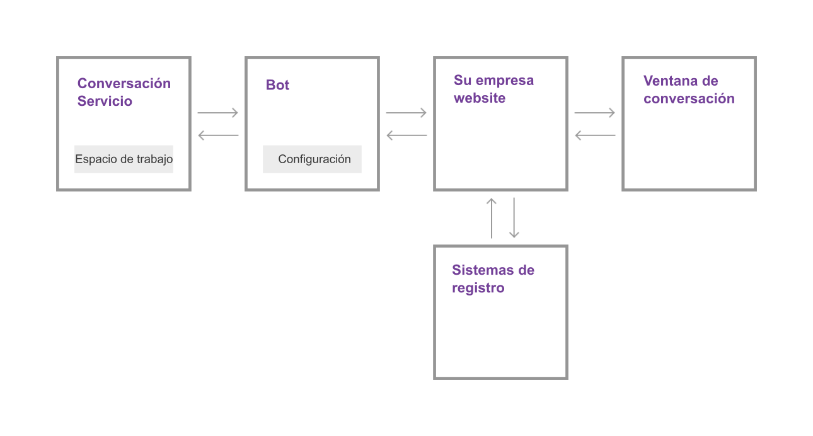

---

copyright:
  years: 2015, 2017
lastupdated: "2017-08-01"

---

{:shortdesc: .shortdesc}
{:new_window: target="_blank"}
{:tip: .tip}
{:pre: .pre}
{:codeblock: .codeblock}
{:screen: .screen}
{:javascript: .ph data-hd-programlang='javascript'}
{:java: .ph data-hd-programlang='java'}
{:python: .ph data-hd-programlang='python'}
{:swift: .ph data-hd-programlang='swift'}

# Descripción general
{: #index}

{{site.data.keyword.virtualagentfull}} es un conjunto de componentes cognitivos preconfigurados que se basan en el servicio {{site.data.keyword.IBM_notm}} {{site.data.keyword.watson}} {{site.data.keyword.conversationshort}}. Cuando configura el agente virtual con la información de su empresa, puede implementar rápidamente un bot de conversación automatizado que conversa con los clientes para ayudarles a conseguir sus objetivos.
{: #shortdesc}

{{site.data.keyword.watson}}&trade; {{site.data.keyword.virtualagentshort}} proporciona los componentes siguientes:

- Una herramienta de configuración que puede utilizar para configurar cómo desea que el bot responda a diversos tipos de solicitudes.
- Un conjunto de prestaciones que representan objetivos o acciones comunes que normalmente los clientes desean realizar (por ejemplo, "Pagar mi factura" o "Indícame vuestro horario comercial").
- Un modelo de lenguaje natural entrenado para identificar intenciones según los datos de entrada de los clientes.
- Un flujo de diálogo de conversación que puede manejar algunas solicitudes complejas solicitando información adicional, generar respuestas y desencadenar sucesos que manejará su aplicación. Si el diálogo predefinido no satisface sus necesidades, puede implementar su propio diálogo personalizado mediante las herramientas de servicio de {{site.data.keyword.watson}} {{site.data.keyword.conversationshort}}.
- Un mecanismo para aumentar las prestaciones del agente con prestaciones personalizadas que define en un espacio de trabajo de {{site.data.keyword.conversationshort}} y enlaza al agente.
- Un widget de conversación que puede incluir en su página web, y un SDK que puede utilizar para desarrollar un widget de conversación personalizado.
- Un conjunto de APIs que puede utilizar para integrar su aplicación con el agente virtual.

## Descripción general de la arquitectura
{: #arch_overview}

El diagrama siguiente muestra la arquitectura de una implementación típica de {{site.data.keyword.watson}} {{site.data.keyword.virtualagentshort}}:

La implementación incluye los siguientes componentes principales:

- **Servicio {{site.data.keyword.conversationshort}}**

    Una instancia del servicio {{site.data.keyword.watson}} {{site.data.keyword.conversationshort}}. El servicio {{site.data.keyword.conversationshort}} proporciona los artefactos para las prestaciones: las intenciones, las entidades y el flujo de diálogo, junto con el proceso cognitivo subyacente que capacita las prestaciones del bot de conversación. Cuando desea implementar sólo un diálogo personalizado o una prestación personalizada, interactúa directamente con el espacio de trabajo de {{site.data.keyword.conversationshort}}.

    Para obtener más información sobre las intenciones y los diálogos, consulte la [documentación del servicio {{site.data.keyword.conversationshort}} ](http://www.ibm.com/watson/developercloud/doc/conversation/configure-workspace.html){: new_window}.

- **Bot**

    Un bot creado en el servicio {{site.data.keyword.conversationshort}}, incluido un conjunto de prestaciones. El bot está entrenado para reconocer consultas de los usuarios relacionadas con la interacción con los clientes como, por ejemplo, solicitudes de información básica sobre la empresa y sobre pagos de facturas. La herramienta de configuración de bot proporcionada le permite configurar la información específica de la empresa que se puede proporcionar en respuesta a las consultas de los usuarios, así como configurar la respuesta para cada prestación.

- **El sitio web de la empresa**

    Su aplicación empresarial orientada a los clientes, que maneja la comunicación con el bot de {{site.data.keyword.watson}} {{site.data.keyword.virtualagentshort}} y con los sistemas de registros (por ejemplo, sistemas de facturación y bases de datos de clientes).

- **Ventana de conversación**

    La interfaz de conversación del agente virtual, que utilizan los clientes para conversar con el bot. Puede utilizar el widget de conversación proporcionado, con o sin personalización, o bien puede utilizar el SDK de cliente para implementar su propio widget de conversación.

