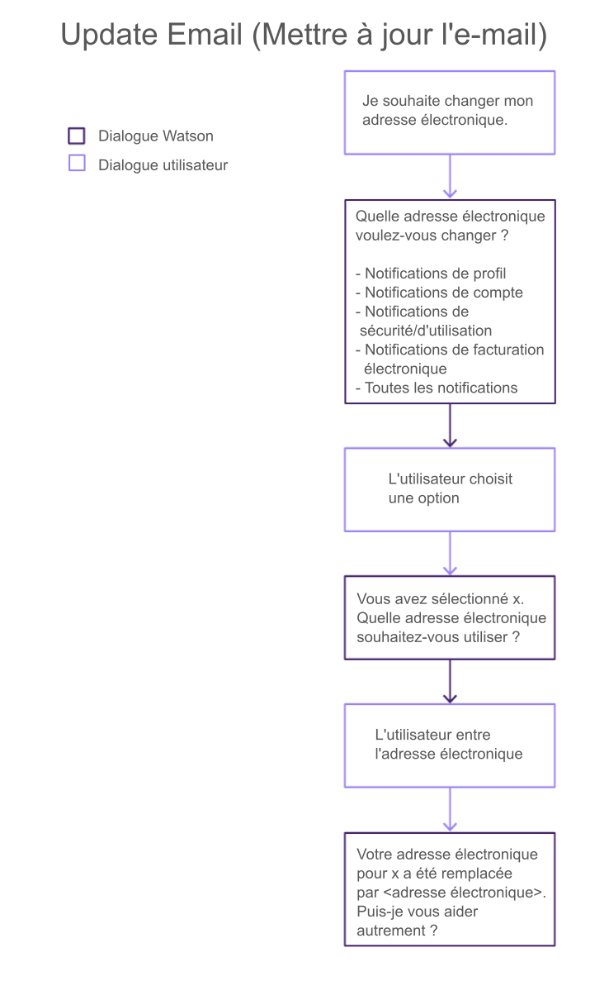

---

copyright:
  years: 2015, 2017
lastupdated: "2017-08-01"

---

{:shortdesc: .shortdesc}
{:new_window: target="_blank"}
{:tip: .tip}
{:pre: .pre}
{:codeblock: .codeblock}
{:screen: .screen}
{:javascript: .ph data-hd-programlang='javascript'}
{:java: .ph data-hd-programlang='java'}
{:python: .ph data-hd-programlang='python'}
{:swift: .ph data-hd-programlang='swift'}

# Configuration des capacités de base
{: #configure}

Pour configurer le bot, vous devez choisir les capacités dont il doit disposer.
{: shortdesc}

## A propos de cette tâche

Une *capacité* représente la faculté de votre agent virtuel à reconnaître et satisfaire un objectif client. Par exemple, la capacité *Find nearest store (Rechercher le magasin le plus proche)* utilise les artefacts préconfigurés et un traitement automatique du langage naturel qui permet d'évaluer un énoncé client, tel que l'énoncé *Où vous trouvez-vous ?*, et de reconnaître l'objectif du client à partir de la réponse. Pour remplir cet objectif, elle dialogue avec le client afin de découvrir son adresse et renvoie l'adresse du magasin le plus proche. 

Le bot est formé pour reconnaître et gérer un ensemble de capacités de base correspondant aux interactions du service clients, et notamment les demandes liées à la facturation, les paiements, les informations sur des magasins et demandes de mise en contact avec un agent humain. Pour une liste de ces capacités, voir [Capacités de base](/docs/services/virtual-agent/intent_list.html). Si les capacités de base ne satisfont pas à un objectif courant spécifique à vos clients, vous pouvez ajouter vos propres capacités à celles fournies. Par exemple, si vous possédez une boulangerie, vos clients risquent de vous demander souvent les saveurs de pâtisserie que vous proposez. Vous pouvez ajouter une capacité *Menu de pâtisseries* pour traiter de telles questions. Pour plus d'informations, voir [Ajout de vos propres capacités](/docs/services/virtual-agent/personalize.html#add_custom_capabilities).

Pour utiliser une capacité de base, indiquez simplement comment vous souhaitez que l'agent se comporte lorsqu'il l'adopte. Pour certaines capacités, il peut suffire de renvoyer une réponse de texte prédéfinie à une demande utilisateur. D'autres peuvent nécessiter un flux de conversation complexe afin de collecter les informations requises pour une transaction, auquel cas l'agent collecte et transmet ces informations à votre application, qui doit implémenter les processus métier requis. 

Par défaut, toutes les capacités de base sont activés et proposent des réponses prédéfinies. Vous devez déterminer au préalable si les capacités non requises par votre agent doivent être désactivées. Pour les capacités à conserver, vous devez remplacer les réponses prédéfinies par des réponses qui reflètent les informations sur votre entreprise.

## Procédure

Pour configurer une capacité de base, procédez comme suit : 

1. Dans la page **Configure (Configuration)** de l'outil de configuration {{site.data.keyword.watson}} {{site.data.keyword.virtualagentshort}}, examinez les capacités disponibles.
1. Pour configurer une capacité, cliquez sur son titre.
1. Déterminez si vous souhaitez que votre bot prenne en charge la capacité. Toutes les capacités sont activées à moins que vous ne les désactiviez. 

    Cliquez sur le commutateur en haut de la page des détails de la capacité pour activer ou désactiver cette dernière.

    Vous pouvez également choisir de laisser activée une capacité que vous ne souhaitez pas prendre en charge, mais qu'un client risque de vous demander, et de fournir une réponse textuelle expliquant que vous ne la prenez pas en charge. Par exemple, si vous ne proposez pas d'assurance, plutôt que de désactiver la capacité **Add insurance (Ajouter une assurance)**, vous pouvez l'activer. Pour un type de réponse, choisissez **Display a text response (Afficher une réponse textuelle)**. Dans la zone **Message** associée, ajoutez *Nous ne proposons pas d'assurance sur nos produits*.

1. Pour chaque capacité à prendre en charge, déterminez le type de réponse à utiliser. Les options possibles sont les suivantes :

    

    - **Display a text response (Afficher une réponse textuelle)**

        Pour les demandes simples, vous pouvez utiliser l'outil de configuration pour spécifier une réponse textuelle standard à présenter à l'utilisateur. Ce type de réponse est utile pour les requêtes dont les réponses sont simples et qui ne nécessitent pas la collecte d'informations supplémentaires ou une interaction avec d'autres systèmes. Par exemple, pour l'intention Method Of Payment Inquiry (Interrogation du moyen de paiement), vous pouvez spécifier la réponse textuelle `Nous acceptons toutes les cartes de crédit les plus courantes`.

        Si vous sélectionnez le type de réponse **Display a text response (Afficher une réponse textuelle)**, vous devez également spécifier le texte de la réponse. 

    - **Use built-in conversation (Utiliser la conversation intégrée)**

        Un ensemble de capacités est fourni avec les dialogues préconfigurés qui collectent des informations supplémentaires ou implémentent un traitement complexe. Un *dialogue* fournit la structure d'une conversation avec l'utilisateur. Pour en savoir plus sur les capacités qui prennent en charge ce type de réponse et sur la manière dont la conversation circule lorsqu'elle est implémentée, voir [Dialogues intégrés](/docs/services/virtual-agent/configure.html#builtin_dialog_ovw).

        Si vous sélectionnez le type de réponse **Use built-in conversation (Utiliser la conversation intégrée)**, il se peut que vous deviez également configurer des données supplémentaires utilisées par le dialogue pour présenter des options à l'utilisateur (par exemple, les lieux de magasin ou les modes de paiement). Dans de nombreux cas, votre application doit écouter les événements qui peuvent être déclenchés par le dialogue et implémenter des actions dans vos systèmes d'enregistrement. Pour plus de détails, voir [Implémentation de la logique de prise en charge de la conversation intégrée](/docs/services/virtual-agent/impl_intents.html#backend_transaction).

    - **Use your own conversation (Utiliser votre propre conversation)**

        Si vous devez implémenter des interactions client complexes pour une capacité, vous pouvez créer votre propre dialogue qui formule la conversation de l'agent avec le client. Cette option requiert des étapes supplémentaires qui impliquent la création d'un dialogue personnalisé avec le service {{site.data.keyword.watson}} {{site.data.keyword.conversationshort}} et son association à l'agent. Pour plus de détails, voir [Création d'un dialogue personnalisé](/docs/services/virtual-agent/personalize.html#custom_dialog).

    - **Transfer to human agent (Transférer vers un agent humain)**

        Pour toute capacité que vous ne souhaitez pas traiter à l'aide de l'agent virtuel, vous pouvez indiquer qu'un événement demandant un agent humain doit être déclenché. Votre application peut alors répondre à cet événement en utilisant vos processus pour lancer une session de discussion avec un représentant du service clients. 

        Si vous sélectionnez le type de réponse **Transfer to human agent (Transférer vers un agent humain)**, vous pouvez également spécifier un message qui fournit le contexte de la demande client à transmettre à l'agent humain.

## Dialogues intégrés
{: #builtin_dialog_ovw}

Les sections ci-après décrivent les capacités de base auxquelles les flux de conversation intégrée sont formés pour les reconnaître et intervenir. 

### Find nearest store (Rechercher le magasin le plus proche)
{: #builtin_dialog_ovw__findNearestStore}

Le diagramme ci-après illustre les noeuds de la conversation intégrée pour la capacité *Find nearest store (Rechercher le magasin le plus proche)*. Le même flux de dialogue est utilisé pour cette capacité et la capacité *Store location (Adresse du magasin)*.

Il ne vous reste plus qu'à ajouter les détails d'emplacement de tous les magasins. Vous pouvez ajouter ces détails à partir de l'une des capacités suivantes, accessibles dans la page Configure (Configuration) :

- Find nearest store (Rechercher le magasin le plus proche)
- Store location (Adresse du magasin)

### Make a payment (Effectuer un paiement)

Le diagramme ci-après illustre les noeuds de la conversation intégrée pour la capacité *Make a payment (Effectuer un paiement)*.

Cliquez [ici](/docs/services/virtual-agent/backend_payment_gif.html#backend_payment_gif) pour voir comment l'entrée utilisateur et les réponses de l'agent virtuel circulent à travers le système.

Pour plus d'informations sur les étapes supplémentaires à effectuer pour prendre en charge intégralement cette capacité, voir [Implémentation de la logique de prise en charge de la conversation intégrée](/docs/services/virtual-agent/impl_intents.html#makeapayment).

### Store hours (Adresse du magasin)

Le diagramme suivant illustre les noeuds de la conversation intégrée pour la capacité *Store hours (Adresse du magasin)*.

Si vous souhaitez fournir les horaires du magasin, vous devez inclure les horaires d'ouverture lorsque vous ajoutez les informations d'emplacement du magasin, par l'intermédiaire des capacités suivantes : 

- Find nearest store (Rechercher le magasin le plus proche)
- Store location (Adresse du magasin)

### Store location (Adresse du magasin)

Reportez-vous au diagramme ci-dessus pour voir les noeuds de la conversation intégrée pour la capacité *Store location (Adresse du magasin)*. Le même flux de dialogue est utilisé pour cette capacité et la capacité [Find nearest store (Rechercher le magasin le plus proche)](/docs/services/virtual-agent/configure.html#builtin_dialog_ovw__findNearestStore).

Il ne vous reste plus qu'à ajouter les détails d'emplacement de tous les magasins. Vous pouvez ajouter ces détails à partir de l'une des capacités suivantes, accessibles dans la page Configure (Configuration) :

- Find nearest store (Rechercher le magasin le plus proche)
- Store location (Adresse du magasin)

### Store phone number (Numéro de téléphone du magasin)

Le diagramme suivant illustre les noeuds de la conversation intégrée pour la capacité *Store phone number (Numéro de téléphone du magasin)*.

Si vous souhaitez fournir les numéros de téléphone du magasin, vous devez les ajouter aux définitions d'emplacement de magasin que vous ajoutez par l'intermédiaire des capacités suivantes : 

- Find nearest store (Rechercher le magasin le plus proche)
- Store location (Adresse du magasin)

### Update address (Mettre à jour l'adresse)

Le diagramme suivant illustre les noeuds de la conversation intégrée pour la capacité *Update address (Mettre à jour l'adresse)*.

Pour plus d'informations sur les étapes supplémentaires à effectuer pour prendre en charge intégralement cette capacité, voir [Implémentation de la logique de prise en charge de la conversation intégrée](/docs/services/virtual-agent/impl_intents.html#updateaddress).

### Update contact phone number (Mettre à jour le numéro de téléphone du contact)

Le diagramme suivant illustre les noeuds de la conversation intégrée pour la capacité *Update contact phone number (Mettre à jour le numéro de téléphone du contact)*.

Pour plus d'informations sur les étapes supplémentaires à effectuer pour prendre en charge intégralement cette capacité, voir [Implémentation de la logique de prise en charge de la conversation intégrée](/docs/services/virtual-agent/impl_intents.html#updatephone).

### Update email (Mettre à jour l'adresse électronique)

Le diagramme suivant illustre les noeuds de la conversation intégrée pour la capacité *Update email (Mettre à jour l'adresse électronique)*.

Pour plus d'informations sur les étapes supplémentaires à effectuer pour prendre en charge intégralement cette capacité, voir [Implémentation de la logique de prise en charge de la conversation intégrée](/docs/services/virtual-agent/impl_intents.html#updateemail).

