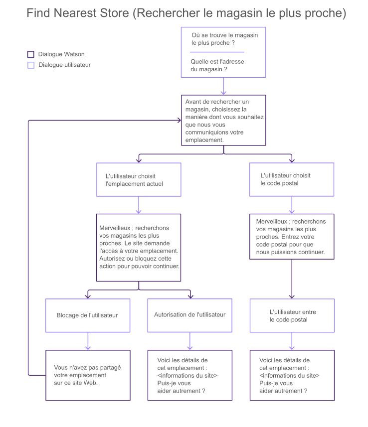
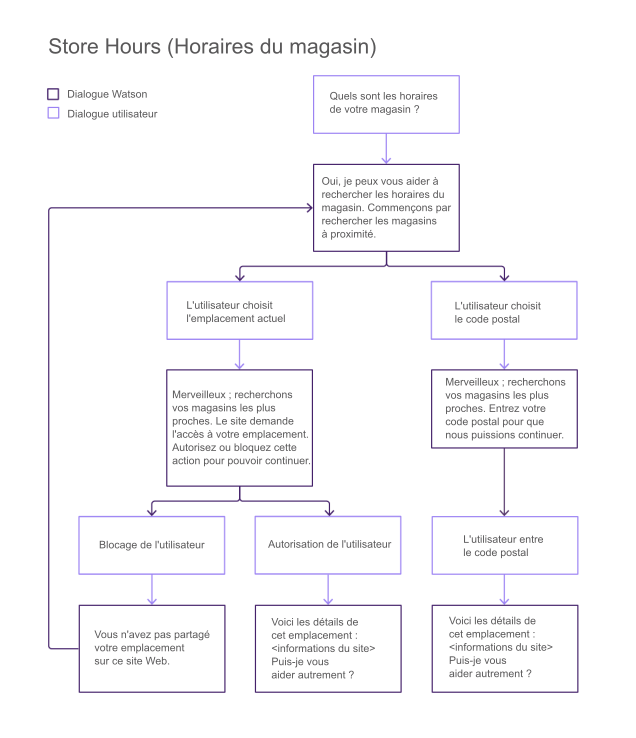
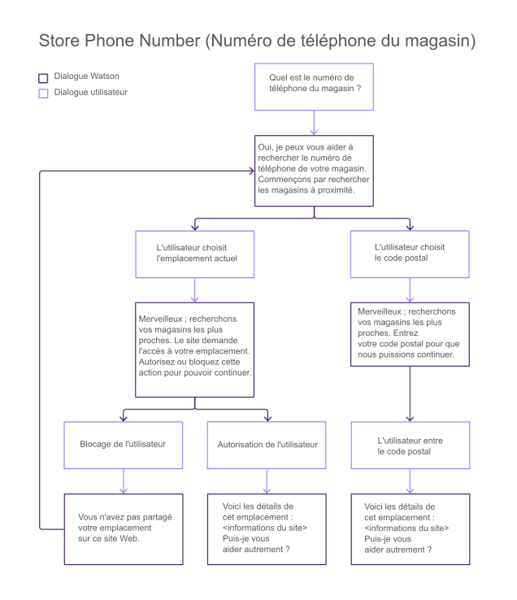
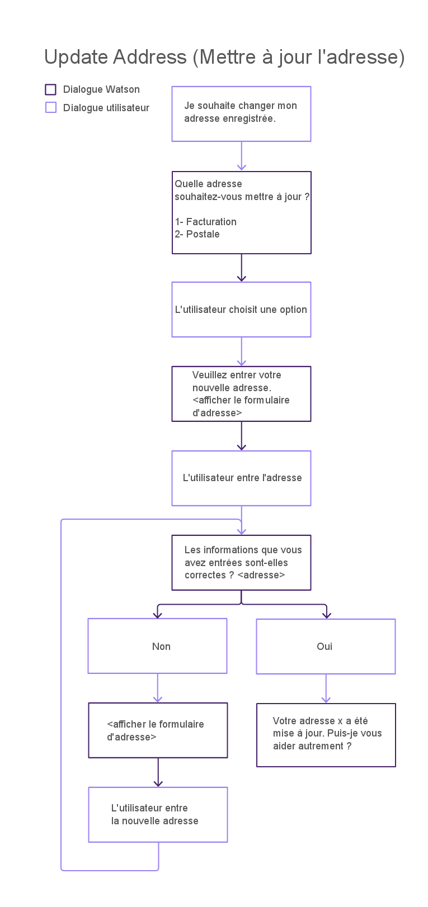

---

copyright:
  years: 2015, 2017
lastupdated: "2017-08-01"

---

{:shortdesc: .shortdesc}
{:new_window: target="_blank"}
{:tip: .tip}
{:pre: .pre}
{:codeblock: .codeblock}
{:screen: .screen}
{:javascript: .ph data-hd-programlang='javascript'}
{:java: .ph data-hd-programlang='java'}
{:python: .ph data-hd-programlang='python'}
{:swift: .ph data-hd-programlang='swift'}

# Personnalisation des réponses de l'agent
{: #integrate_backend}

Déterminez la manière dont vous souhaitez que l'agent répondre aux clients. Vous pouvez utiliser la conversation intégrée ou fournir une conversation personnalisée pour personnaliser les réponses de l'agent.
{: shortdesc}

[Utilisation de la conversation intégrée](/docs/services/virtual-agent/integrate_backend.html#use_builtin)

[Utilisation de votre propre conversation](/docs/services/virtual-agent/integrate_backend.html#use_custom)

## Utilisation de la conversation intégrée
{: #use_builtin}

Pour un ensemble de tâches courantes, {{site.data.keyword.watson}}
{{site.data.keyword.virtualagentshort}} fournit des flux de conversation intégrée que vous pouvez utiliser
tels quels pour simplifier le processus d'extraction d'informations des utilisateurs afin d'effectuer une
tâche. 

### Dialogues intégrés
{: #builtin_dialog_ovw}

Les sections ci-après décrivent les intentions auxquelles les flux de conversation intégrée sont formés pour les reconnaître et intervenir. 

#### Find nearest store
{: #builtin_dialog_ovw__findNearestStore}

Le diagramme ci-après illustre les noeuds de la conversation intégrée pour l'intention *Find nearest store (Rechercher le magasin le plus proche)*. Le même flux de dialogue est utilisé pour cette intention et l'intention *Store location*.



Il ne vous reste plus qu'à ajouter les détails d'emplacement de tous les magasins. Vous pouvez ajouter ces détails à partir de l'une des intentions suivantes, accessibles dans la page Configure (Configuration) :

- Find nearest store (Rechercher le magasin le plus proche)
- Store location (Adresse du magasin)

#### Make a payment (Effectuer un paiement)

Le diagramme ci-après illustre les noeuds de la conversation intégrée pour l'intention *Make a payment (Effectuer un paiement)*. 


Cliquez [ici](/docs/services/virtual-agent/backend_payment_gif.html) pour voir comment l'entrée utilisateur et les réponses de l'agent virtuel circulent à travers le système.

Pour plus d'informations sur les étapes supplémentaires à effectuer pour prendre en charge intégralement cette intention, voir [Implémentation de la logique de prise en charge de la conversation intégrée](/docs/services/virtual-agent/integrate_backend.html#backend_transaction).

#### Store hours (Adresse du magasin)

Le diagramme suivant illustre les noeuds de la conversation intégrée pour l'intention *Store hours (Adresse du magasin)*.



Si vous souhaitez fournir les horaires du magasin, vous devez inclure les horaires
d'ouverture lorsque vous ajoutez les informations d'emplacement du magasin, par
l'intermédiaire des intentions suivantes : 

- Find nearest store (Rechercher le magasin le plus proche)
- Store location (Adresse du magasin)

#### Store location (Adresse du magasin)

Reportez-vous au diagramme ci-dessus pour voir les noeuds de la conversation intégrée pour l'intention *Store location*. Le même flux de dialogue est utilisé pour cette intention et l'intention [Find nearest store (Rechercher le magasin le plus proche)](/docs/services/virtual-agent/integrate_backend.html#builtin_dialog_ovw__findNearestStore).

Il ne vous reste plus qu'à ajouter les détails d'emplacement de tous les magasins. Vous pouvez ajouter ces détails à partir de l'une des intentions suivantes, accessibles dans la page Configure (Configuration) :

- Find nearest store (Rechercher le magasin le plus proche)
- Store location (Adresse du magasin)

#### Store phone number (Numéro de téléphone du magasin)

Le diagramme suivant illustre les noeuds de la conversation intégrée pour l'intention *Store phone number (Numéro de téléphone du magasin)*.



Si vous souhaitez fournir les numéros de téléphone du magasin, vous devez les ajouter aux définitions d'emplacement de magasin que vous ajoutez par l'intermédiaire des intentions suivantes : 

- Find nearest store (Rechercher le magasin le plus proche)
- Store location (Adresse du magasin)

#### Update address (Mettre à jour l'adresse)

Le diagramme suivant illustre les noeuds de la conversation intégrée pour l'intention *Update address (Mettre à jour l'adresse)*.



Pour plus d'informations sur les étapes supplémentaires à effectuer pour prendre en charge intégralement cette intention, voir [Implémentation de la logique de prise en charge de la conversation intégrée](/docs/services/virtual-agent/integrate_backend.html#backend_transaction).

#### Update contact phone number (Mettre à jour le numéro de téléphone du contact)

Le diagramme suivant illustre les noeuds de la conversation intégrée pour l'intention *Update contact phone number (Mettre à jour le numéro de téléphone du contact)*.


Pour plus d'informations sur les étapes supplémentaires à effectuer pour prendre en charge intégralement cette intention, voir [Implémentation de la logique de prise en charge de la conversation intégrée](/docs/services/virtual-agent/integrate_backend.html#backend_transaction).

#### Update email (Mettre à jour l'adresse électronique)

Le diagramme suivant illustre les noeuds de la conversation intégrée pour l'intention *Update email (Mettre à jour l'adresse électronique)*.


Pour plus d'informations sur les étapes supplémentaires à effectuer pour prendre en charge intégralement cette intention, voir [Implémentation de la logique de prise en charge de la conversation intégrée](/docs/services/virtual-agent/integrate_backend.html#backend_transaction).

### Implémentation de la logique de prise en charge de la conversation intégrée
{: #backend_transaction}

Découvrez comment échanger des informations et effectuer des processus métier traités par le widget de discussion
fourni lorsque des utilisateurs interagissent avec des intentions configurées
pour utiliser la conversation intégrée. 

#### A propos de cette tâche

Certaines des intentions configurées pour utiliser le type de réponse de la conversation intégrée par défaut peuvent traiter les processus métier. Votre application doit pouvoir enregistrer la transaction auprès des systèmes d'enregistrement dorsaux.

- Si vous implémentez le widget de discussion {{site.data.keyword.IBM_notm}} fourni, il reconnaît les événements déclenchés par certaines réponses utilisateur. 
Toutefois, des étapes supplémentaires sont à effectuer pour écouter ces événements dans votre
application afin que vous puissiez effectuer les transactions initiées sur vos systèmes dorsaux.
- Si vous n'utilisez pas le widget de discussion fourni, vous devez vous assurer
que votre interface utilisateur personnalisée peut reconnaître les événements déclenchés par les flux de conversation intégrée
et les traiter de manière appropriée.

Par exemple, avec l'intention **Update address (Mettre à jour l'adresse)**, un utilisateur peut changer l'adresse de facturation sur son compte. 
Vous devez écrire le code qui extrait la nouvelle adresse de l'agent virtuel et met à
jour le compte de l'utilisateur sur votre système d'enregistrement avec les nouvelles
informations.

Notez bien que le seul objectif d'un dialogue est de collecter des informations de l'utilisateur. Ces informations sont stockées de l'une des deux manières suivantes : 

- Les informations non sensibles ou privées sont stockées dans le contexte du dialogue, un objet de données disponible à la fois pour le bot et votre application.
- Les informations sensibles ou privées (telles que les numéros de carte de crédit) sont stockées dans des variables privées, accessibles uniquement par votre application et non transmises au bot.

#### Procédure

Pour implémenter intégralement les transactions commerciales déclenchées à partir
d'intentions avec des réponses de la conversation intégrée pour le widget de discussion {{site.data.keyword.IBM_notm}}, procédez comme suit : 

1. Ajoutez à votre application une logique qui extrait du système dorsal les informations de profil de l'utilisateur actuel à afficher dans la fenêtre de discussion avant que ces dernières ne soient modifiées. Par exemple, montrer aux utilisateurs un solde de compte avant qu'ils n'effectuent un règlement. 

    Utilisez l'action `getUserProfileVariables`. Cette action extrait les variables et les définit dans le profil.

    ```
    IBMChat.subscribe('action:getUserProfileVariables', function(data) {
     var variables = data.message.action.args.variables; // spécifiez les variables à extraire dans cette matrice
       for (var i = 0; i < variables.length; i++) {
           var value = something(variables[i])
           /*Effectuez une opération pour extraire la valeur des variables[i]. Il peut s'agir d'un appel ajax ou d'une extraction de
           données de cookies locaux. En fonction de l'emplacement dans lequel vous avez stocké les informations.*/
           window.IBMChat.profile.set(variables[i], value);
       }
       IBMChat.sendSilently('success'); // ou cancel ou failure
    });
    ```
    {: screen}

    Cet exemple utilise un appel REST pour obtenir des informations sur le solde et la date d'échéance d'une facture. 

    ```
    var xmlHttp = new XMLHttpRequest();
      xmlHttp.onreadystatechange = function() {
        if (xmlHttp.readyState == 4 && xmlHttp.status == 200)
          callback(xmlHttp.responseText);
      }
      xmlHttp.open("GET", url, true);
      xmlHttp.send(null);
    }
    /* Extrayez des informations de la base de données dorsale et ajoutez-les
    au profil avec IBMChat.profile.set(). */
    IBMChat.subscribe('action:getUserProfileVariables', function(data) {
     /*
     data = {
       message: {
          text: ['some text'],
                action: {
                     name: 'getUserProfileVariables',
                     args: {
                         variables: [
                    "bill_amount",
                    "payment_due_date"
                ]
                     }
                }
       }
    
     }
     */
    
     httpGetAsync('http://yourdomain.com/userprofile', function(user) {
       /* L'enregistrement sur le système dorsal peut renvoyer des informations telles que les suivantes :
       user = {
         "bill_amount": 42.01,
         "payment_due_date": "11/24/2008"
       }
       */
       var variables = data.message.action.args.variables;
       for (var i = 0; i < variables.length; i++) {
         var value = user[variables[i]]);
         window.IBMChat.profile.set(variables[i], value);
       /* Le widget de discussion peut maintenant utiliser les valeurs qu'il a extraites du service dorsal. */
       }
       IBMChat.sendSilently('success'); // ou cancel ou failure
     });
    });
    ```
    {: screen}

1. Ajoutez à votre application une logique qui écoute l'action à l'origine du processus métier, puis effectue le processus métier.

    Pour une liste des actions associées à des intentions disposant de types de réponses de la conversation intégrée, voir [https://github.com/watson-virtual-agents/virtual-agent-dialog/blob/master/dialog-contract.md#action ](https://github.com/watson-virtual-agents/virtual-agent-dialog/blob/master/dialog-contract.md#action){: new_window}.
    - **Make a payment (Effectuer un paiement)** {: #makeapayment}

        Effectuez les étapes ci-après pour implémenter un code qui prend en charge cette transaction.
        1. Votre application doit extraire le solde actuel de l'utilisateur et la date d'échéance du système dorsal. Utilisez la méthode `action:getUserProfileVariables` et définissez les variables `bill_amount` et `payment_due_date` dans le magasin de profils.
        1. Votre application doit écouter l'événement `payBill` et définir la logique à effectuer lorsque l'événement est déclenché. 
        1. Votre application doit également écouter l'événement `sendPaymentReceipt` et définir la logique à effectuer lorsque l'événement est déclenché. 

    - **Update address (Mettre à jour l'adresse)** {: #updateaddress}

        1. Le widget de discussion utilise une présentation de formulaire pour demander la nouvelle adresse de l'utilisateur et la stocke automatiquement dans le profil. Il stocke les variables de profil suivantes : 

            ```
            user_street_address1
            user_street_address2
            user_locality
            user_state_or_province
            user_zipcode
            ```
            {: screen}

        1. Votre application doit écouter l'événement `updateAddress`.

            ```
            IBMChat.subscribe('action:updateAddress', function(data) {<your-code>}
            ```
            {: screen}

            Définissez une fonction qui extrait et envoie la nouvelle adresse et le type d'adresse (`address_type`) au système dorsal lorsque
l'action `updateAddress` est déclenchée.

            Pour collecter des données comportant de nombreuses valeurs, telles
que l'adresse postale, vous pouvez utiliser la présentation de formulaire intégrée au
widget de discussion. Les utilisateurs entrent des valeurs dans plusieurs zones, puis
soumettent le formulaire complet. Par exemple, pour envoyer la nouvelle adresse à votre site via un appel REST POST, vous pouvez utiliser une logique telle que la suivante : 

            ```
            /* Lorsqu'un utilisateur saisit des informations dans un formulaire, elles sont automatiquement ajoutées
            au profil de l'utilisateur. Donc un flux type peut par exemple inclure une présentation de formulaire dans la fenêtre de discussion,
            puis appeler cette action une fois que le formulaire a été soumis */
            IBMChat.subscribe('action:updateAddress', function(data) {
              var record = {
                "first_name": IBMChat.profile.get('first_name'),
                "last_name": IBMChat.profile.get('last_name'),
                "user_street_address1": IBMChat.profile.get('user_street_address1'),
                "user_street_address2": IBMChat.profile.get('user_street_address2'),
                "user_locality": IBMChat.profile.get('user_locality'),
                "user_state_or_province": IBMChat.profile.get('user_state_or_province'),
                "user_zipcode": IBMChat.profile.get('user_zipcode')
              };
              httpPostAsync('/updateRecord/', record, function(err, response) {
                if (err) IBMChat.receive('There was an error updating the address.');
              });
            });
            ```
            {: screen}

            Pour plus d'informations sur les présentations intégrées, voir [https://github.com/watson-virtual-agents/virtual-agent-dialog/blob/master/dialog-contract.md#layout ](https://github.com/watson-virtual-agents/virtual-agent-dialog/blob/master/dialog-contract.md#layout){: new_window}.

    - **Update contact phone number (Mettre à jour le numéro de téléphone du contact)** {: #updatephone}

        1. Le widget de discussion utilise une présentation de formulaire pour demander le nouveau numéro de téléphone de l'utilisateur et le stocke automatiquement dans le profil. Il stocke les variables de profil suivantes : 

            ```
            user_phone_number
            phone_number_type
            ```
            {: screen}

        1. Votre application doit écouter l'événement
`updatePhoneNumber` et définir la logique permettant de recevoir et d'envoyer
le nouveau numéro de téléphone et son type au système dorsal lorsque l'événement est déclenché. 

    - **Update email (Mettre à jour l'adresse électronique)** {: #updateemail}

        1. Le widget de discussion utilise une présentation de formulaire pour demander la nouvelle adresse électronique de l'utilisateur et la stocke automatiquement dans le profil. Il stocke les variables de profil suivantes : 

            ```
            user_email_address
            email_type
            ```
            {: screen}

        1. Votre application doit écouter l'événement
`updateEmail` et définir la logique permettant de recevoir et d'envoyer
la nouvelle adresse électronique au système dorsal lorsque l'événement est déclenché. 
Elle envoie également des informations sur les types de notification pour lesquels la
nouvelle adresse doit être utilisée (`email_type`).

## Utilisation de votre propre conversation
{: #use_custom}

Pour toute intention, vous pouvez choisir d'utiliser votre propre conversation afin d'interagir avec l'utilisateur pour satisfaire l'intention. 

### Création d'un dialogue personnalisé
{: #custom_dialog}

Si certaines de vos intentions prises en charge doivent être gérées par un dialogue personnalisé, vous pouvez utiliser le service {{site.data.keyword.IBM_notm}} {{site.data.keyword.watson}} {{site.data.keyword.conversationshort}} pour créer le dialogue, puis le connecter à votre agent virtuel.

#### A propos de cette tâche

Le service {{site.data.keyword.watson}} {{site.data.keyword.conversationshort}} est un ensemble d'outils et d'API que vous utilisez pour développer des applications qui utilisent des interfaces en langage naturel pour automatiser les interactions avec les clients. {{site.data.keyword.watson}} {{site.data.keyword.virtualagentshort}} utilise le service {{site.data.keyword.conversationshort}} pour définir les intentions apprises et le flux de dialogue utilisés par le bot. Si le dialogue fourni n'offre pas la flexibilité dont vous avez besoin ou ne traite pas actuellement une intention à prendre en charge, vous pouvez développer votre propre dialogue à l'aide des outils du service {{site.data.keyword.conversationshort}}.

> **Remarque :** seules les intentions pour lesquelles vous avez sélectionné le type de réponse **Use your own conversation (Utiliser votre propre conversation)** sont traitées par votre dialogue.

A des fins de compatibilité avec l'agent virtuel, tout dialogue que vous créez doit respecter les instructions de conception disponibles à la page [https://github.com/watson-virtual-agents/virtual-agent-dialog/blob/master/dialog-contract.md ](https://github.com/watson-virtual-agents/virtual-agent-dialog/blob/master/dialog-contract.md){: new_window}. Ces instructions indiquent comment le dialogue interagit avec l'interface de discussion de l'agent virtuel et notamment comment afficher les invites aux utilisateurs et où stocker les informations fournies par ces derniers afin qu'elles soient accessibles par l'interface de la fenêtre de discussion.

Le référentiel {{site.data.keyword.virtualagentshort}} {{site.data.keyword.dialogshort}} fournit également des exemples qui illustrent le mode de fonctionnement des interactions des dialogues. Vous pouvez en utiliser un comme modèle pour votre propre dialogue. Reportez-vous à l'[exemple de fichier JSON de flux de dialogues ](https://github.com/watson-virtual-agents/virtual-agent-dialog/blob/master/sample_dialog_flows.json){: new_window}.

#### Procédure

Pour créer un dialogue personnalisé : 

1. Si vous ne l'avez pas déjà fait, inscrivez-vous au service {{site.data.keyword.watson}} {{site.data.keyword.conversationshort}}. 
Pour plus d'informations, reportez-vous au [Guide
d'initiation du service {{site.data.keyword.conversationshort}} ](http://www.ibm.com/watson/developercloud/doc/conversation/getting-started.html){: new_window}.
1. Créez un espace de travail qui contiendra votre dialogue.Pour plus d'informations sur les espaces de travail, reportez-vous au document relatif à la [création d'un espace de travail avec le service {{site.data.keyword.conversationshort}} ](http://www.ibm.com/watson/developercloud/doc/conversation/create-workspace.html){: new_window}.
1. Accédez à l'onglet {{site.data.keyword.dialogshort}}. (Vous n'avez pas besoin de créer d'intentions ou d'entités.)
1. Créez un noeud de dialogue qui détecte une intention pour laquelle vous avez sélectionné le type de réponse **Use your own conversation (Utiliser votre propre conversation)**. Par exemple, pour l'intention "Add insurance (Ajouter une assurance)", votre dialogue teste #Service_Management-Add_Insurance. Pour découvrir le nom de code des intentions, voir [Noms de code des intentions](/docs/services/virtual-agent/intent_codenames.html).
1. Ajoutez des noeuds si nécessaire pour créer le flux de dialogue requis. Assurez-vous que votre dialogue
respecte les instructions de conception de dialogue {{site.data.keyword.virtualagentshort}}, accessibles à l'adresse suivante : https://github.com/watson-virtual-agents/virtual-agent-dialog/blob/master/dialog-contract.md
{: new_window}.

#### Etape suivante

Si votre dialogue prend en charge des interactions utilisateur ou des transactions que l'interface de discussion fournie, une fois personnalisée, ne peut pas traiter, vous pouvez également fournir une interface de discussion personnalisée. Pour plus de détails, voir [Création d'une interface de discussion personnalisé](/docs/services/virtual-agent/integrate.html#custom_chat).

