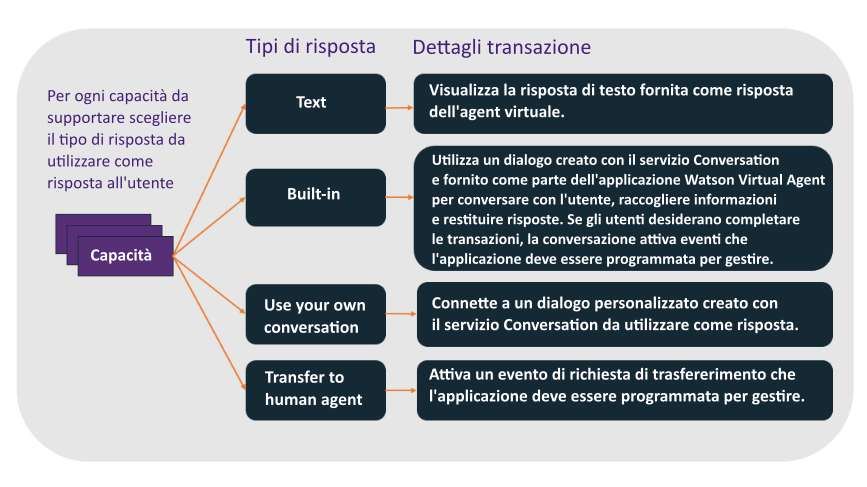
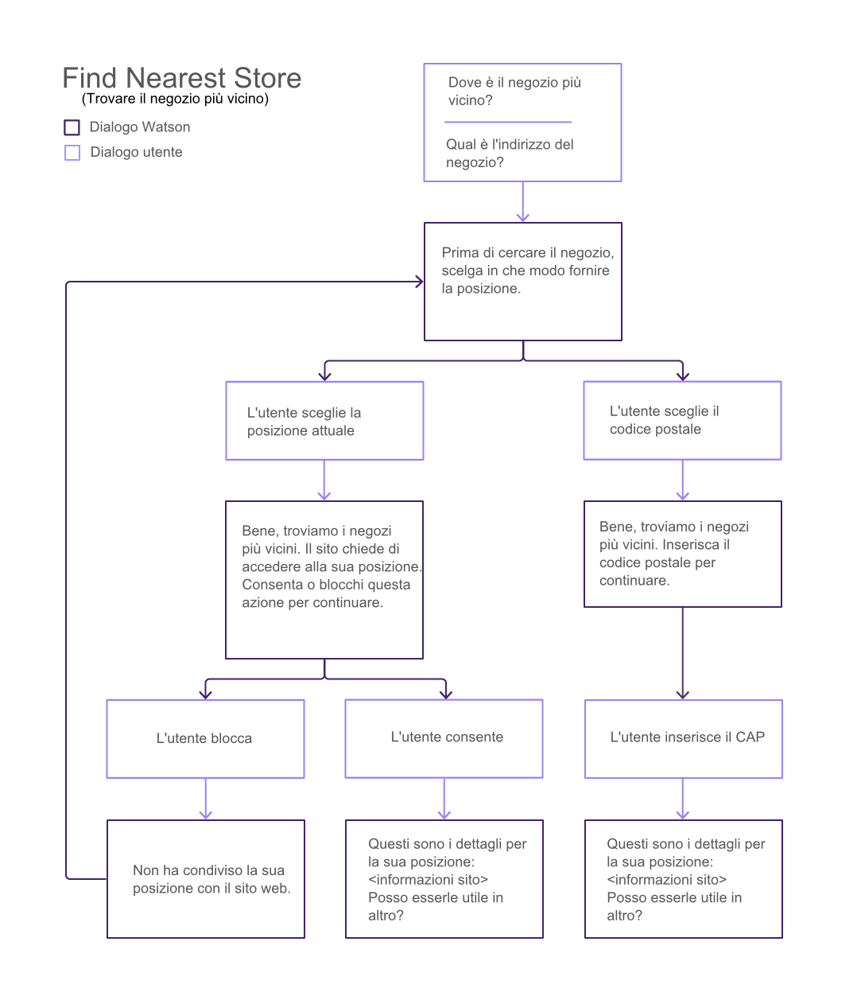
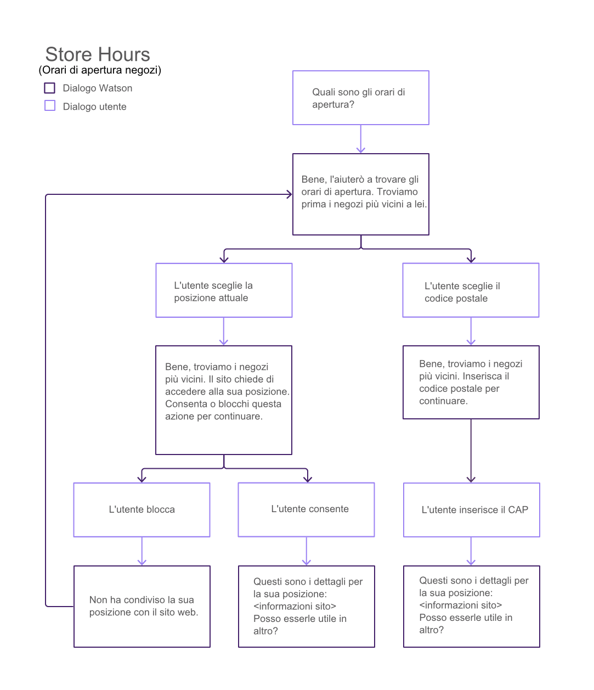
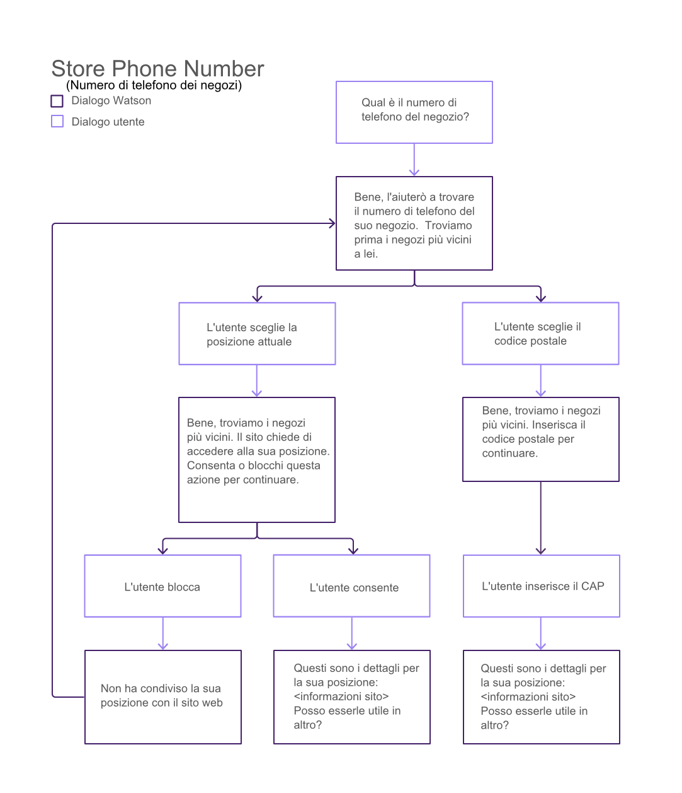

---

copyright:
  years: 2015, 2017
lastupdated: "2017-08-10"

---

{:shortdesc: .shortdesc}
{:new_window: target="_blank"}
{:tip: .tip}
{:pre: .pre}
{:codeblock: .codeblock}
{:screen: .screen}
{:javascript: .ph data-hd-programlang='javascript'}
{:java: .ph data-hd-programlang='java'}
{:python: .ph data-hd-programlang='python'}
{:swift: .ph data-hd-programlang='swift'}

# Configurazione delle capacità base 
{: #configure}

Per configurare il bot, è necessario scegliere le capacità che si desidera utilizzare.
{: shortdesc}

Una capacità è l'abilità di un agent virtuale di riconoscere e
raggiungere uno specifico obiettivo del cliente. Per ulteriori dettagli, vedere
[Capacità](how-it-works.html#capabilities).

Per utilizzare una capacità base, specificare semplicemente il comportamento
desiderato dell'agent quando si applica questa capacità. Per alcune capacità, potrebbe
essere sufficiente emettere una risposta con testo pre-definito alla domanda dell'utente. Per
altre potrebbe essere necessario un flusso di conversazione complesso
per raccogliere le informazioni richieste per eseguire una transazione, in questo caso l'agent
raccoglie e passa le informazioni all'applicazione, che deve implementare i processi di business
richiesti.

Per impostazione predefinita, tutte le capacità base sono abilitate e hanno
risposte preconfezionate. È necessario prima decidere se disabilitare le capacità che non sono
necessarie per il proprio agent. Per le capacità che si desidera mantenere, è necessario
sostituire le risposte preconfezionate con risposte che corrispondono alle informazioni sul proprio
business.

Per configurare una capacità base, completare i seguenti passi:

1.  Aprire la pagina **Capabilities (Capacità)** per visualizzare un elenco delle
capacità supportate dall'agent corrente, raggruppate per categoria.

1.  Esaminare le capacità e decidere quali dovranno essere supportate dal bot. Tutte le capacità sono
abilitate a meno che non vengano disattivate.

    Selezionare l'interruttore per attivare o disattivare una capacità. Per disabilitare
tutte le capacità in una categoria, fare clic su sul menu **More (Altro)**
 sul riquadro della
categoria e poi selezionare **Turn All Off (Disattiva tutto)**.

    In alternativa, per una capacità che non si intende supportare, ma che si pensa
potrebbe essere richiesta dal cliente, è possibile scegliere di mantenere abilitata la
capacità e di fornire un risposta con un testo che spiega che la capacità non è
supportata. Ad esempio, se non si offre un'assicurazione, invece di disabilitare la
capacità **Aggiungere un'assicurazione**, si potrebbe abilitarla. Come tipo di risposta
scegliere **Text (Testo)**. Nel
campo **Message (Messaggio)** associato, aggiungere *Non offriamo
assicurazioni per i nostri prodotti*.

1.  Per configurare una capacità, fare clic sul nome della capacità.

1.  Scegliere il tipo di risposta da visualizzare all'utente quando viene attivata
questa capacità. Le opzioni sono le seguenti:

    

    - **Text (Testo)**

        Per domande semplici, è possibile utilizzare lo strumento di configurazione per
specificare una risposta con testo standard da visualizzare all'utente. Questo tipo di risposta è
utile per le domande che hanno risposte semplici e non richiedono la raccolta di ulteriori informazioni o
qualsiasi interazione con altri sistemi. Ad esempio, per un intento Domande sul metodi di pagamento, si potrebbe specificare la risposta di testo `Accettiamo
tutte le principali carte di credito`.

        Se si seleziona il tipo di risposta **Text**, è necessario anche specificare il testo della risposta.

    - **Built-in (Incorporato)**

        Una serie di capacità sono distribuite con dialoghi pre-generati che
raccolgono ulteriori informazioni o implementano gestioni complesse. Un *dialogo*
fornisce la struttura per una conversazione con un utente. Per ulteriori informazioni sulle
capacità che supportano questo tipo di risposta e sul flusso di conversazione implementato,
vedere
[Dialoghi incorporati](configure.html#builtin_dialog_ovw).

        Se si seleziona il tipo di risposta **Built-in (Incorporato)**, potrebbe essere anche necessario configurare ulteriori dati che il
dialogo utilizza per presentare le scelte all'utente (ad esempio l'ubicazione del negozio o i metodi
di pagamento). In molti casi, l'applicazione deve essere in
attesa di eventi che possono essere attivati dal dialogo e implementare azioni nei sistemi di
registrazione. Per ulteriori dettagli, vedere
[Implementazione della logica per il supporto
della conversazione incorporata](impl_intents.html#backend_transaction).

    - **Use your own conversation (Utilizzare una propria conversazione)**

        Se per una capacità è necessario implementare interazioni con il cliente
complesse, è possibile generare un proprio dialogo che determina la conversazione dell'agent con il
cliente. Questa opzione richiede altre operazioni che comprendono la creazione di un dialogo
personalizzato con il servizio {{site.data.keyword.watson}}
{{site.data.keyword.conversationshort}} e il collegamento del dialogo all'agent. Per
ulteriori dettagli, vedere [Creazione di un dialogo personalizzato](add-custom-dialog.html).

    - **Transfer to human agent (Trasferire a un agent umano)**

        Per qualsiasi capacità che non si desidera gestire con l'agent virtuale, è
possibile specificare che deve essere attivato un evento che richiede un agent umano. L'applicazione
può quindi rispondere a questo evento utilizzando i processi per avviare una sessione di chat
con una persona rappresentante del servizio clienti.

        Se si seleziona il tipo di risposta **Transfer to human
agent (Trasferire a un agent umano)**, è possibile specificare un messaggio che fornisce il contesto per la
richiesta del cliente da trasmettere anche all'agent umano.

1.  Fare clic su **Save (Salva)** per salvare la scelta. Apportare
eventuali ulteriori modifiche richieste in base al tipo di risposta e salvarle.

    È possibile fare clic sulla freccia indietro accanto al nome capacità per tornare alla
pagina principale Capabilities (Capacità).

## Dialoghi incorporati 
{: #builtin_dialog_ovw}

Nelle sezioni seguenti sono descritte le capacità base
che i flussi di conversazioni incorporate sono addestrati a riconoscere e a cui reagire.

### Find nearest store (Trova il negozio più vicino)
{: #builtin_dialog_ovw__findNearestStore}

Il seguente diagramma mostra i nodi nella conversazione incorporata per la capacità
*Find nearest store (Trova il negozio più vicino)*. Lo
stesso flusso di dialogo è utilizzato per questa capacità e per la capacità *Store
location (Ubicazione del negozio)*.

L'unica ulteriore operazione richiesta è l'aggiunta dei dettagli sull'ubicazione per ogni
negozio. È possibile aggiungere i dettagli del negozio da una delle seguenti capacità a cui è
possibile accedere dalla pagina Configure:

- Find nearest store (Trova il negozio più vicino)
- Store location (Ubicazione del negozio)

### Make a payment (Effettua un pagamento)

Il seguente diagramma mostra i nodi nella conversazione incorporata per la capacità
*Make a payment (Effettua un
pagamento)*.

Fare clic [qui](backend_payment_gif.html#backend_payment_gif) per visualizzare il flusso dell'input utente e delle risposte dell'agent virtuale nel sistema.

Per informazioni sulle ulteriori operazioni da eseguire per supportare completamente questa
capacità, vedere [Implementazione della logica per
il supporto della conversazione incorporata](impl_intents.html#makeapayment).

### Store hours (Orari di apertura dei negozi)

Il seguente diagramma mostra i nodi nella conversazione incorporata per la capacità
*Store hours (Orari di apertura dei negozi)*.

Se si desidera fornire gli orari di apertura dei negozi, è necessario includere le
informazioni sugli orari di apertura quando si aggiungono le informazioni di ubicazione dei negozi
con le seguenti capacità:

- Find nearest store (Trova il negozio più vicino)
- Store location (Ubicazione del negozio)

### Store location (Ubicazione del negozio)

Il seguente diagramma mostra i nodi nella conversazione incorporata per la capacità
*Store location (Ubicazione del negozio)*. Lo stesso flusso di dialogo è utilizzato
per questa capacità e per la capacità
[Find nearest store (Trova il negozio più vicino)](configure.html#builtin_dialog_ovw__findNearestStore).

L'unica ulteriore operazione richiesta è l'aggiunta dei dettagli sull'ubicazione per ogni
negozio. È possibile aggiungere i dettagli del negozio da una delle seguenti capacità a cui è
possibile accedere dalla pagina Configure (Configura):

- Find nearest store (Trova il negozio più vicino)
- Store location (Ubicazione del negozio)

### Store phone number (Numero di telefono dei negozi)

Il seguente diagramma mostra i nodi nella conversazione incorporata per la capacità
*Store phone number (Numero di telefono dei negozi)*.

Se si desidera fornire i numeri di telefono dei negozi, è necessario aggiungerli alle
definizioni di ubicazione dei negozi aggiunte con le seguenti capacità:

- Find nearest store (Trova il negozio più vicino)
- Store location (Ubicazione del negozio)

### Update address (Aggiorna indirizzo)

Il seguente diagramma mostra i nodi nella conversazione incorporata per la capacità
*Update address (Aggiorna indirizzo)*.

Per informazioni sulle ulteriori operazioni da eseguire per supportare completamente questa
capacità, vedere [Implementazione della logica per
il supporto della conversazione incorporata](impl_intents.html#updateaddress).

### Update contact phone number (Aggiorna il numero telefonico del contatto)

Il seguente diagramma mostra i nodi nella conversazione incorporata per la capacità
*Update contact phone number (Aggiorna il numero telefonico del contatto)*.

Per informazioni sulle ulteriori operazioni da eseguire per supportare completamente questa
capacità, vedere [Implementazione della logica per il
supporto della conversazione incorporata](impl_intents.html#updatephone).

### Update email (Aggiorna indirizzo email)

Il seguente diagramma mostra i nodi nella conversazione incorporata per la capacità
*Update email (Aggiorna indirizzo email)*.

Per informazioni sulle ulteriori operazioni da eseguire per supportare completamente questa
capacità, vedere [Implementazione della logica per il
supporto della conversazione incorporata](impl_intents.html#updateemail).
