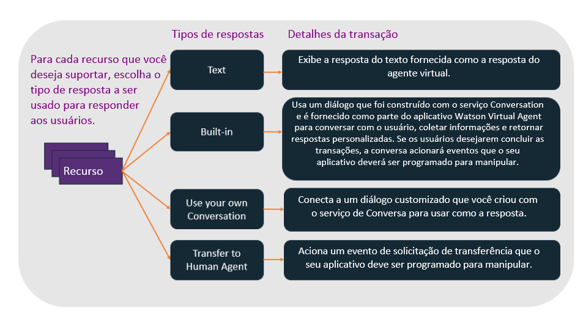
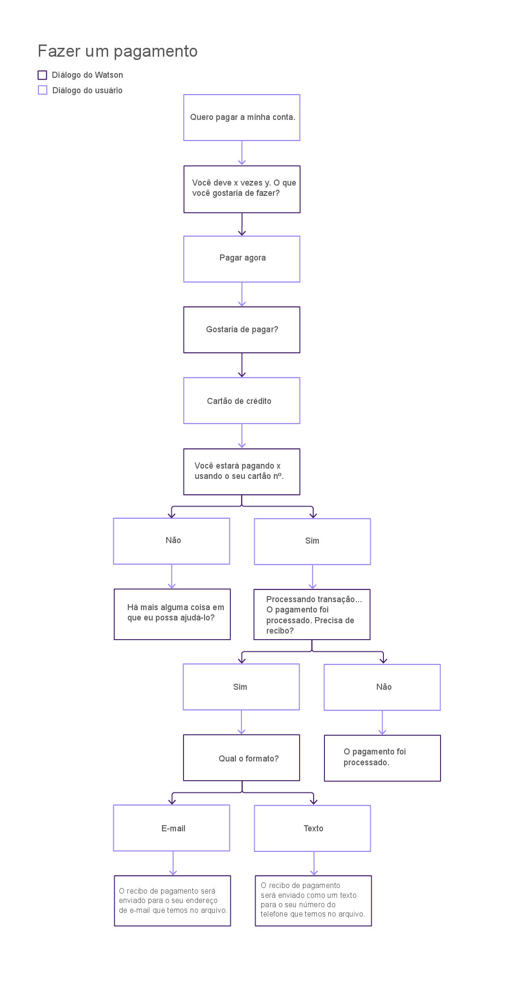
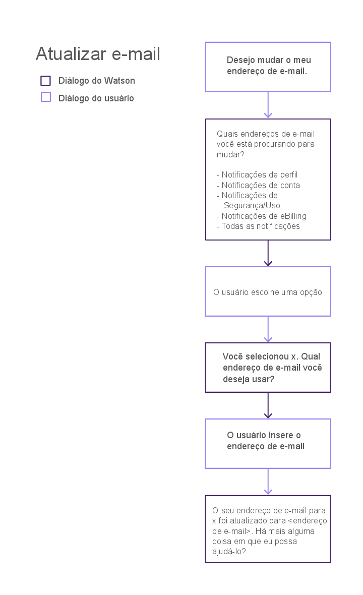

---

copyright:
  years: 2015, 2017
lastupdated: "2017-08-10"

---

{:shortdesc: .shortdesc}
{:new_window: target="_blank"}
{:tip: .tip}
{:pre: .pre}
{:codeblock: .codeblock}
{:screen: .screen}
{:javascript: .ph data-hd-programlang='javascript'}
{:java: .ph data-hd-programlang='java'}
{:python: .ph data-hd-programlang='python'}
{:swift: .ph data-hd-programlang='swift'}

# Configurando os recursos principais 
{: #configure}

Para configurar o robô, deve-se escolher os recursos que você deseja que ele tenha.
{: shortdesc}

Um recurso é a capacidade de seu agente virtual reconhecer e satisfazer um objetivo do cliente específico. Consulte [Capabilities (Recursos)](how-it-works.html#capabilities) para obter mais detalhes.

Para usar um recurso principal, basta especificar como você deseja que o agente se comporte ao implementar o recurso. Para alguns recursos, retornar uma
resposta de texto predefinida para uma consulta de usuário pode ser suficiente. Outros podem requerer um fluxo de conversa complexo para reunir informações que são
necessárias para executar uma transação, caso em que o agente coleta e transmite informações ao seu aplicativo, que deve implementar os processos de negócios
necessários.

Por padrão, todos os recursos principais são ativados e têm respostas predeterminadas. Deve-se, primeiramente, decidir se será desativado qualquer recurso
não necessário para o seu agente. Para recursos que você deseja manter, deve-se substituir as respostas predeterminadas por respostas que reflitam as informações
sobre os seus negócios.

Para configurar um recurso principal, conclua as etapas a seguir:

1.  Abra a página **Capabilities (Recursos)** para ver uma lista de recursos agrupados por categoria que são suportados pelo agente atual.

1.  Revise os recursos e decida quais você deseja que sejam suportados por seu robô. Todos os recursos são ativados, a menos que você os desligue.

    Clique no comutador para ativar ou desativar um recurso. Para desativar todos os recursos em uma categoria, clique no menu **More (Mais)**  no quadro da categoria e, em seguida, selecione **Turn All Off (Desligar Tudo)**.

    Como alternativa, para um recurso que você não tem intenção de suportar, mas que suspeita que um cliente possa perguntar a respeito, será possível manter
o recurso ativado e fornecer uma resposta de texto para ele que explique que você não o suporta. Por exemplo, se você não oferecer seguro, em vez de desativar o
recurso **Incluir seguro**, você poderia ativá-lo. Para um tipo de resposta, escolha **Text (Texto)**. No campo
da **Message (Mensagem)** associado, inclua *Nós não oferecemos seguro para os nossos produtos*.

1.  Para configurar um recurso, clique no nome do recurso.

1.  Escolha o tipo de resposta a ser exibida para o usuário quando este recurso for acionado. Estas são as opções:

    

    - **Text (Texto)**

        Para consultas simples, é possível usar a ferramenta de configuração para especificar uma resposta textual padrão a ser exibida para o
usuário. Esse tipo de resposta será útil para consultas que tiverem respostas simples e que não requererem a reunião de informações adicionais ou qualquer interação
com outros sistemas. Por exemplo, para a intenção Consulta de Método de pagamento, é possível especificar a resposta de texto `We accept all major credit
cards (Aceitamos todos os cartões de crédito)`.

        Se você selecionar o tipo de resposta **Text (Texto)**, também deverá especificar o texto da resposta.

    - **Built-in (Integrado)**

        Um conjunto de recursos é fornecido com diálogos pré-construídos que coletam informações adicionais ou implementam manipulação complexa. Um
*diálogo* fornece a estrutura para uma conversa com o usuário. Consulte [Diálogos integrados](configure.html#builtin_dialog_ovw) para saber
mais sobre quais recursos suportam esse tipo de resposta e como a conversa flui quando implementada.

        Se você selecionar o tipo de resposta **Built-in (Integrado)**, também poderá ser necessário configurar dados adicionais que o diálogo usa para apresentar opções ao usuário (como localizações de lojas ou métodos de pagamento). Em muitos casos, o seu aplicativo deve atender aos eventos que podem ser
acionados pelo diálogo e implementar ações em seus sistemas de registro. Consulte
[Implementando a lógica para suportar a conversa integrada](impl_intents.html#backend_transaction) para obter mais detalhes.

    - **Use your own conversation (Use sua própria conversa)**

        Se você precisar implementar interações complexas de cliente para um recurso, será possível construir o seu próprio diálogo que molde a conversa do
agente com o cliente. Esta opção requer etapas adicionais que envolvem a construção de um diálogo customizado com o serviço do {{site.data.keyword.watson}}
{{site.data.keyword.conversationshort}} e a sua vinculação com o agente. Consulte [Construindo um diálogo
customizado](add-custom-dialog.html) para obter mais detalhes.

    - **Transfer to human agent (Transferir para agente humano)**

        Para qualquer recurso com o qual você não deseja lidar usando o agente virtual, será possível especificar que você deseja que seja acionado um evento
que solicite um agente humano. O seu aplicativo poderá então responder a esse evento usando os seus processos para iniciar uma sessão de bate-papo com um responsável
humano pelo atendimento ao cliente.

        Se você selecionar o tipo de resposta **Transfer to human agent (Transferir para agente humano)**, será possível especificar uma mensagem que forneça
o contexto para a solicitação do cliente ser transmitida para o agente humano também.

1.  Clique em **Save (Salvar)** para salvar suas opções. Faça quaisquer mudanças adicionais que são necessárias com base no tipo de resposta e salve-as.

    É possível clicar na seta voltar próxima ao nome do recurso para retornar à página principal Capabilities (Recursos).

## Diálogos integrados 
{: #builtin_dialog_ovw}

As seções a seguir descrevem os recursos principais que os fluxos de conversa integrada são treinados para reconhecer e reagir a eles.

### Localizar a loja mais próxima
{: #builtin_dialog_ovw__findNearestStore}

O diagrama a seguir mostra os nós na conversa integrada para o recurso *Localizar a loja mais próxima*. O mesmo fluxo de diálogo é
usado para esse recurso e o recurso *Local da loja*.

A única etapa adicional requerida por você é incluir os detalhes do local da loja para cada loja. É possível incluir os detalhes da loja por meio de um dos
recursos a seguir que pode ser acessado por meio da página Configure:

- Localizar a loja mais próxima
- Local da loja

### Fazer um pagamento

O diagrama a seguir mostra os nós na conversa integrada para o recurso *Fazer um pagamento*.

Clique [aqui](backend_payment_gif.html#backend_payment_gif) para ver como a entrada do usuário e as respostas do agente virtual fluem através
do sistema.

Consulte [Implementando a lógica para suportar a conversa integrada](impl_intents.html#makeapayment) para obter informações sobre as etapas
adicionais que deve-se executar para suportar totalmente este recurso.

### Horários de Funcionamento

O diagrama a seguir mostra os nós na conversa integrada para o recurso *Horas da loja*.

Se você deseja fornecer as horas da loja, então, deve-se incluir as informações de horário comercial quando você inclui as informações do local da loja por meio
dos recursos a seguir:

- Localizar a loja mais próxima
- Local da loja

### Local da loja

Consulte o diagrama acima para ver os nós na conversa integrada para o recurso *Local da loja*. O mesmo fluxo de diálogo é
usado para esse recurso e o recurso [Localizar a loja mais próxima](configure.html#builtin_dialog_ovw__findNearestStore).

A única etapa adicional requerida por você é incluir os detalhes do local da loja para cada loja. É possível incluir os detalhes da loja por meio de um dos
recursos a seguir que pode ser acessado por meio da página Configure:

- Localizar a loja mais próxima
- Local da loja

### Número do telefone da loja

O diagrama a seguir mostra os nós na conversa integrada para o recurso *Número do telefone da loja*.

Se você deseja fornecer números do telefone da loja, então, deve-se inclui-los nas definições de local da loja que você inclui por meio
dos recursos a seguir:

- Localizar a loja mais próxima
- Local da loja

### Atualizar endereço

O diagrama a seguir mostra os nós na conversa integrada para o recurso *Atualizar endereço*.

Consulte [Implementando a lógica para suportar a conversa integrada](impl_intents.html#updateaddress) para obter informações sobre as etapas
adicionais que deve-se executar para suportar totalmente este recurso.

### Atualizar o número do telefone de contato

O diagrama a seguir mostra os nós na conversa integrada para o recurso *Atualizar o número do telefone de contato*.

Consulte [Implementando a lógica para suportar a conversa integrada](impl_intents.html#updatephone) para obter informações sobre as etapas
adicionais que deve-se executar para suportar totalmente este recurso.

### Atualizar e-mail

O diagrama a seguir mostra os nós na conversa integrada para o recurso *Atualizar e-mail*.

Consulte [Implementando a lógica para suportar a conversa integrada](impl_intents.html#updateemail) para obter informações sobre as etapas
adicionais que deve-se executar para suportar totalmente este recurso.
