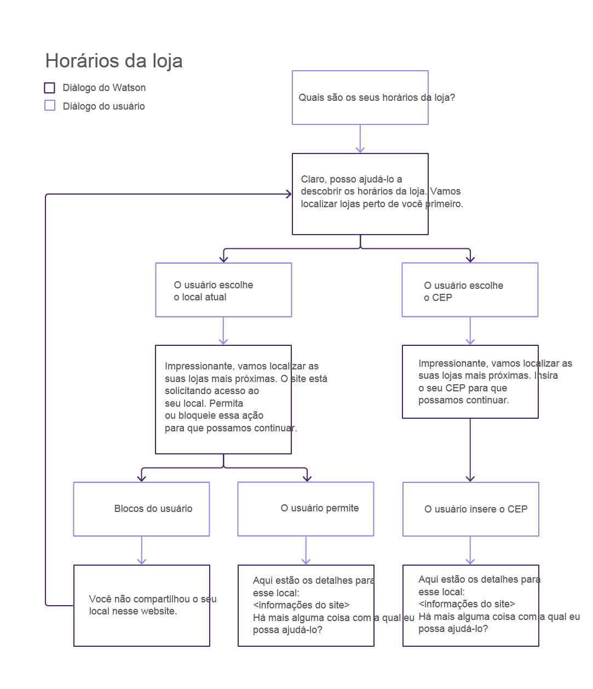
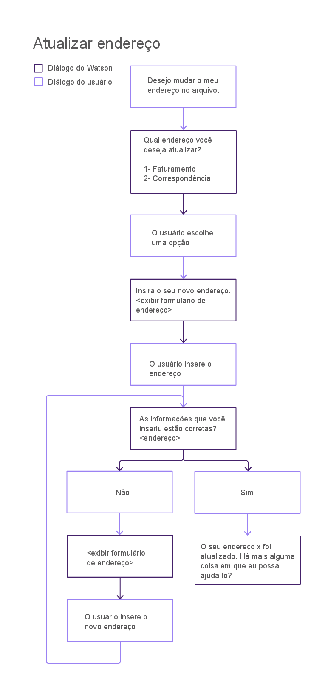
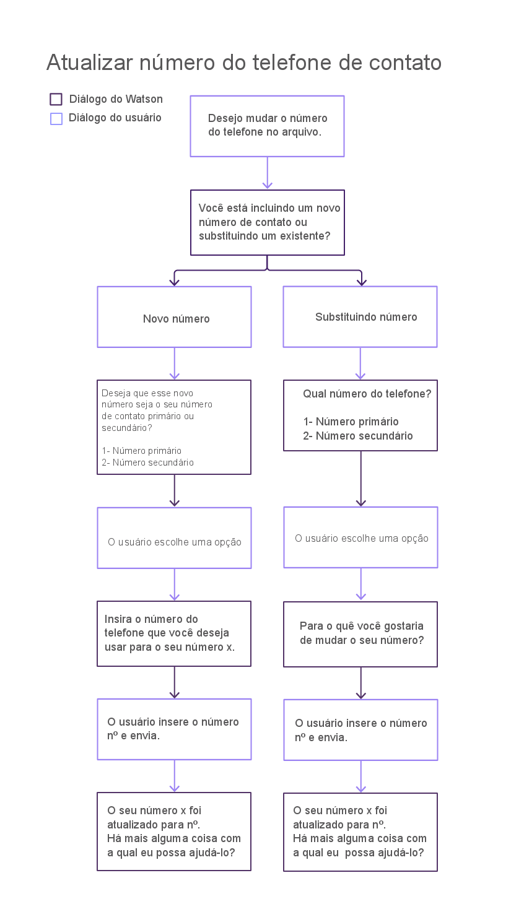

---

copyright:
  years: 2015, 2017
lastupdated: "2017-08-01"

---

{:shortdesc: .shortdesc}
{:new_window: target="_blank"}
{:tip: .tip}
{:pre: .pre}
{:codeblock: .codeblock}
{:screen: .screen}
{:javascript: .ph data-hd-programlang='javascript'}
{:java: .ph data-hd-programlang='java'}
{:python: .ph data-hd-programlang='python'}
{:swift: .ph data-hd-programlang='swift'}

# Personalizando as respostas de agente
{: #integrate_backend}

Determine como você deseja que o agente responda aos clientes. É possível usar a conversa integrada ou fornecer uma conversa customizada para personalizar as
respostas de agente.
{: shortdesc}

[Usando a conversa integrada](/docs/services/virtual-agent/integrate_backend.html#use_builtin)

[Usando a sua própria conversa](/docs/services/virtual-agent/integrate_backend.html#use_custom)

## Usando a conversa integrada
{: #use_builtin}

Para um conjunto de tarefas comuns, o {{site.data.keyword.watson}} {{site.data.keyword.virtualagentshort}} fornece fluxos de conversa integrada
que podem ser usados no estado em que se encontram para simplificar o processo de obtenção de informações de usuários para executar uma tarefa.

### Diálogos integrados
{: #builtin_dialog_ovw}

As seções a seguir descrevem as intenções que os fluxos de conversa integrada são treinados para reconhecer e reagir a elas.

#### Localizar a loja mais próxima
{: #builtin_dialog_ovw__findNearestStore}

O diagrama a seguir mostra os nós na conversa integrada para a intenção *Localizar a loja mais próxima*. O mesmo fluxo de diálogo é
usado para essa intenção e a intenção *Local da loja*.


A única etapa adicional requerida por você é incluir os detalhes do local da loja para cada loja. É possível incluir os detalhes da loja por meio de uma das
intenções a seguir que pode ser acessada por meio da página Configurar:

- Localizar a loja mais próxima
- Local da loja

#### Fazer um pagamento

O diagrama a seguir mostra os nós na conversa integrada para a intenção *Fazer um pagamento*.


Clique [aqui](/docs/services/virtual-agent/backend_payment_gif.html) para ver como a entrada do usuário e as respostas do agente virtual fluem através do sistema.

Consulte [Implementando a lógica para suportar a conversa integrada](/docs/services/virtual-agent/integrate_backend.html#backend_transaction) para obter informações sobre as etapas
adicionais que deve-se tomar para suportar totalmente esta intenção.

#### Horários de Funcionamento

O diagrama a seguir mostra os nós na conversa integrada para a intenção *Horários da loja*.



Se você deseja fornecer os horários da loja, então, deve-se incluir as informações de horário comercial ao incluir as informações do local da loja por meio
das intenções a seguir:

- Localizar a loja mais próxima
- Local da loja

#### Local da loja

Consulte o diagrama acima para ver os nós na conversa integrada para a intenção *Local da loja*. O mesmo fluxo de diálogo é usado para essa
intenção e a intenção [Localizar a loja mais próxima](/docs/services/virtual-agent/integrate_backend.html#builtin_dialog_ovw__findNearestStore).

A única etapa adicional requerida por você é incluir os detalhes do local da loja para cada loja. É possível incluir os detalhes da loja por meio de uma das
intenções a seguir que pode ser acessada por meio da página Configurar:

- Localizar a loja mais próxima
- Local da loja

#### Número do telefone da loja

O diagrama a seguir mostra os nós na conversa integrada para a intenção *Número do telefone da loja*.


Se você deseja fornecer números do telefone da loja, então, deve-se inclui-los nas definições de local da loja que você inclui por meio das intenções a seguir:

- Localizar a loja mais próxima
- Local da loja

#### Atualizar endereço

O diagrama a seguir mostra os nós na conversa integrada para a intenção *Atualizar endereço*.



Consulte [Implementando a lógica para suportar a conversa integrada](/docs/services/virtual-agent/integrate_backend.html#backend_transaction) para obter informações sobre as
etapas adicionais que deve-se tomar para suportar totalmente esta intenção.

#### Atualizar o número do telefone de contato

O diagrama a seguir mostra os nós na conversa integrada para a intenção *Atualizar o número do telefone de contato*.



Consulte [Implementando a lógica para suportar a conversa integrada](/docs/services/virtual-agent/integrate_backend.html#backend_transaction) para obter informações sobre as
etapas adicionais que deve-se tomar para suportar totalmente esta intenção.

#### Atualizar e-mail

O diagrama a seguir mostra os nós na conversa integrada para a intenção *Atualizar e-mail*.


Consulte [Implementando a lógica para suportar a conversa integrada](/docs/services/virtual-agent/integrate_backend.html#backend_transaction) para obter informações sobre as
etapas adicionais que deve-se tomar para suportar totalmente esta intenção.

### Implementando a lógica para suportar conversa integrada
{: #backend_transaction}

Saiba como trocar informações e processos de negócios completos que o widget de bate-papo fornecido transaciona quando os usuários interagem com intenções que
são configuradas para usar a conversa integrada.

#### Sobre essa Tarefa

Algumas das intenções que são configuradas para usar o tipo de resposta de conversa integrada por padrão podem transacionar processos de negócios. O seu
aplicativo deve ser capaz de registrar a transação com os sistemas backend de registro.

- Se você implementar o widget de bate-papo {{site.data.keyword.IBM_notm}} fornecido, ele reconhecerá eventos que são acionados por determinadas
respostas do usuário. No entanto, há etapas adicionais que deve-se executar para atender a esses eventos em seu aplicativo para que seja possível concluir as
transações iniciadas no seu sistema backend.
- Se você não está usando o widget de bate-papo fornecido, então, deve-se assegurar que a sua interface com o usuário customizado pode reconhecer eventos que
são acionados pelos fluxos de conversas integradas e manipulá-los apropriadamente.

Por exemplo, com a intenção **Atualizar endereço**, um usuário pode mudar o endereço para cobrança em sua conta. Deve-se gravar o código que
obtém o novo endereço por meio do agente virtual e atualiza a conta do usuário em seu sistema de registro com as novas informações.

É importante observar que o propósito de um diálogo é apenas reunir informações do usuário. As informações fornecidas pelo usuário são armazenadas em uma das
duas maneiras:

- As informações que não forem sensíveis ou privadas serão armazenadas no contexto de diálogo, que é um objeto de dados disponível para ambos, o robô e o seu
aplicativo.
- Informações sensíveis ou privadas (como números de cartão de crédito) são armazenadas em variáveis privadas, que estão disponíveis apenas para o seu
aplicativo e não são transmitidas para o robô. 

#### Procedimento

Para implementar completamente as transações de negócios acionadas por meio de intenções com respostas de conversa integrada para o widget de bate-papo da
{{site.data.keyword.IBM_notm}}, conclua as etapas a seguir:

1. Inclua a lógica em seu aplicativo que obtém informações de perfil para o usuário atual do sistema backend para mostrar na janela de bate-papo antes das
informações serem mudadas. Por exemplo, mostrar aos usuários um saldo da conta antes que eles a paguem.

    Use a ação `getUserProfileVariables`. Esta ação obtém as variáveis e as configura no perfil.

    ```
    IBMChat.subscribe('action:getUserProfileVariables', function(data) {
     var variables = data.message.action.args.variables; // specify the variables you want to get in this array
       for (var i = 0; i < variables.length; i++) {
           var value = something(variables[i])
           /*do something to get the value of variables[i]. might be an ajax call or getting
           data from local cookies. Depends on where you stored the information.*/
           window.IBMChat.profile.set(variables[i], value);
       }
       IBMChat.sendSilently('success'); // or cancel or failure
    });
    ```
    {: screen}

    Este exemplo usa uma chamada REST para obter informações sobre um saldo da conta e uma data de vencimento.

    ```
    var xmlHttp = new XMLHttpRequest();
      xmlHttp.onreadystatechange = function() {
        if (xmlHttp.readyState == 4 && xmlHttp.status == 200)
          callback(xmlHttp.responseText);
      }
      xmlHttp.open("GET", url, true);
      xmlHttp.send(null);
    }
    /* Get information from the backend database and add it
    into the profile with IBMChat.profile.set(). */
    IBMChat.subscribe('action:getUserProfileVariables', function(data) {
     /*
     data = {
       message: {
          text: ['some text'],
                action: {
                     name: 'getUserProfileVariables',
                     args: {
                         variables: [
                    "bill_amount",
                    "payment_due_date"
                ]
                     }
                }
       }
    
     }
     */
    
     httpGetAsync('http://yourdomain.com/userprofile', function(user) {
       /* The record on the backend system might return information like this.
       user = {
         "bill_amount": 42.01,
         "payment_due_date": "11/24/2008"
       }
       */
       var variables = data.message.action.args.variables;
       for (var i = 0; i < variables.length; i++) {
         var value = user[variables[i]]);
         window.IBMChat.profile.set(variables[i], value);
       /* Now the chat widget can use the values it retrieved from the backend service. */
       }
       IBMChat.sendSilently('success'); // or cancel or failure
     });
    });
    ```
    {: screen}

1. Inclua lógica em seu aplicativo que primeiro atende à ação que inicia o processo de negócios e, em seguida, executa o processo de negócios.

    Para obter uma lista de ações que são associadas a intenções que têm tipos de resposta de conversa integrada, veja
[https://github.com/watson-virtual-agents/virtual-agent-dialog/blob/master/dialog-contract.md#action ](https://github.com/watson-virtual-agents/virtual-agent-dialog/blob/master/dialog-contract.md#action){: new_window}.
    - **Fazer um pagamento** {: #makeapayment}

        Execute as etapas a seguir para implementar o código que suporta esta transação.
        1. O seu aplicativo deve recuperar o saldo atual do usuário e a data de vencimento do sistema backend. Use o método
`action:getUserProfileVariables` para obter e configurar as variáveis `bill_amount` e `payment_due_date` na loja de
perfil.
        1. O seu aplicativo deve atender ao evento `payBill` e definir a lógica para executar quando o evento é acionado.
        1. O seu aplicativo também deve atender ao evento `sendPaymentReceipt` e definir a lógica para executar quando o evento é acionado.

    - **Atualizar endereço
** {: #updateaddress}

        1. O widget de bate-papo usa um layout de formulário para perguntar pelas informações de novo endereço do usuário e armazená-las no perfil
automaticamente. Ele armazena estas variáveis de perfil:

            ```
            user_street_address1
            user_street_address2
            user_locality
            user_state_or_province
            user_zipcode
            ```
            {: screen}

        1. O seu aplicativo deve atender ao evento `updateAddress`.

            ```
            IBMChat.subscribe('action:updateAddress', function(data) {<your-code>}
            ```
            {: screen}

            Defina uma função que obtém e envia o novo endereço e o tipo de endereço (`address_type`) para o sistema backend quando a ação
`updateAddress` é acionada.

            Para coletar dados com muitos valores, como um endereço residencial, é possível usar o layout de formulário que é construído no widget de
bate-papo. Os usuários inserem valores em múltiplos campos e, em seguida, enviam o formulário inteiro. Por exemplo, para enviar o novo endereço para o seu site por
meio de uma chamada REST POST, é possível usar a lógica como esta.

            ```
            /* When a user enters information into a form, it is automatically added
            to the user profile. So a typical flow would be to include a form layout in the
            chat window, and then call this action after the form is submitted */
            IBMChat.subscribe('action:updateAddress', function(data) {
              var record = {
                "first_name": IBMChat.profile.get('first_name'),
                "last_name": IBMChat.profile.get('last_name'),
                "user_street_address1": IBMChat.profile.get('user_street_address1'),
                "user_street_address2": IBMChat.profile.get('user_street_address2'),
                "user_locality": IBMChat.profile.get('user_locality'),
                "user_state_or_province": IBMChat.profile.get('user_state_or_province'),
                "user_zipcode": IBMChat.profile.get('user_zipcode')
              };
              httpPostAsync('/updateRecord/', record, function(err, response) {
                if (err) IBMChat.receive('There was an error updating the address.');
              });
            });
            ```
            {: screen}

            Para obter mais informações sobre layouts integrados, veja
[https://github.com/watson-virtual-agents/virtual-agent-dialog/blob/master/dialog-contract.md#layout ](https://github.com/watson-virtual-agents/virtual-agent-dialog/blob/master/dialog-contract.md#layout){: new_window}.

    - **Atualizar o número do telefone de contato** {: #updatephone}

        1. O widget de bate-papo usa um layout de formulário para perguntar o novo número do telefone do usuário e o armazena no perfil automaticamente. Ele
armazena estas variáveis de perfil:

            ```
            user_phone_number
            phone_number_type
            ```
            {: screen}

        1. O seu aplicativo deve atender ao evento `updatePhoneNumber` e definir a lógica para obter e enviar o novo número do telefone e tipo
para o sistema backend quando o evento é acionado.

    - **Atualizar e-mail** {: #updateemail}

        1. O widget de bate-papo usa um layout de formulário para perguntar o novo endereço de e-mail do usuário e o armazena no perfil automaticamente. Ele
armazena estas variáveis de perfil:

            ```
            user_email_address
            email_type
            ```
            {: screen}

        1. O seu aplicativo deve atender ao evento `updateEmail` e definir a lógica para obter e enviar o novo endereço de e-mail para o
sistema backend quando o evento é acionado. Ele também envia informações sobre para quais tipos de notificação usar o novo endereço (`email_type`).

## Usando a sua própria conversa
{: #use_custom}

Para qualquer intenção, é possível escolher usar a sua própria conversa para interagir com o usuário e satisfazer a intenção.

### Construindo um diálogo customizado
{: #custom_dialog}

Se alguma de suas intenções suportadas requerer manipulação por um diálogo customizado, será possível usar o serviço do {{site.data.keyword.IBM_notm}}
{{site.data.keyword.watson}} {{site.data.keyword.conversationshort}} para construir o diálogo e, em seguida, conectá-lo ao seu agente virtual.

#### Sobre essa Tarefa

O serviço do {{site.data.keyword.watson}} {{site.data.keyword.conversationshort}} é um conjunto de ferramentas e APIs que é possível usar para
construir aplicativos que usam interfaces de língua natural para automatizar interações com clientes. O {{site.data.keyword.watson}}
{{site.data.keyword.virtualagentshort}} usa o serviço do {{site.data.keyword.conversationshort}} para definir as intenções treinadas e o fluxo de
diálogo usados pelo robô. Se o diálogo não fornecer a flexibilidade necessária ou não manipular atualmente uma intenção que você precisa suportar, será
possível construir o seu próprio diálogo usando as ferramentas de serviço do {{site.data.keyword.conversationshort}}.

> **Nota:** Apenas as intenções para as quais você selecionou o tipo de resposta **Usar a sua própria conversa**
são processadas por seu diálogo.
Para compatibilidade com o agente virtual, qualquer diálogo que você construir deve estar em conformidade com as diretrizes de design em
[https://github.com/watson-virtual-agents/virtual-agent-dialog/blob/master/dialog-contract.md ](https://github.com/watson-virtual-agents/virtual-agent-dialog/blob/master/dialog-contract.md){: new_window}. Estas diretrizes especificam como o diálogo interage com a interface de bate-papo do agente virtual, incluindo como
exibir prompts para usuários e onde armazenar informações fornecidas pelos usuários para que ele possa ser acessado pela interface de janela de bate-papo.

O repositório do {{site.data.keyword.virtualagentshort}} {{site.data.keyword.dialogshort}} também fornece exemplos que ilustram como as
interações de diálogo funcionam. É possível usar a amostra como um modelo para o seu próprio diálogo. Consulte o
[arquivo do JSON de fluxos de diálogo de amostra ](https://github.com/watson-virtual-agents/virtual-agent-dialog/blob/master/sample_dialog_flows.json){: new_window}.

#### Procedimento

Para construir um diálogo customizado:

1. Se você não fez isso ainda, inscreva-se para o serviço do {{site.data.keyword.watson}} {{site.data.keyword.conversationshort}}. Para
obter mais informações, veja a documentação do serviço do
[{{site.data.keyword.conversationshort}}
Introdução ](http://www.ibm.com/watson/developercloud/doc/conversation/getting-started.html){: new_window}.
1. Crie uma área de trabalho para conter o seu diálogo. Para obter informações sobre áreas de trabalho, veja a documentação
do serviço do [{{site.data.keyword.conversationshort}}
Criando uma área de trabalho ](http://www.ibm.com/watson/developercloud/doc/conversation/create-workspace.html){: new_window}.
1. Navegue para a guia do {{site.data.keyword.dialogshort}}. (Não é necessário criar qualquer intenção ou entidade.)
1. Crie um nó de diálogo que detecte uma intenção para a qual você selecionou o tipo de resposta **Usar a sua própria conversa**. Por
exemplo, para a intenção "Incluir seguro", a sua caixa de diálogo testaria para #Service_Management-Add_Insurance. Para descobrir o nome de código das intenções, veja
[Nomes de código de intenção](/docs/services/virtual-agent/intent_codenames.html).
1. Inclua os nós conforme necessário para criar o fluxo de diálogo necessário. Certifique-se de que o seu diálogo esteja em conformidade com as diretrizes de
design do diálogo do {{site.data.keyword.virtualagentshort}} em
[https://github.com/watson-virtual-agents/virtual-agent-dialog/blob/master/dialog-contract.md ](https://github.com/watson-virtual-agents/virtual-agent-dialog/blob/master/dialog-contract.md){: new_window}.

#### O que fazer em seguida

Se o seu diálogo customizado suportar interações com o usuário ou transações que a interface de bate-papo fornecida não pode ser customizada para manipular,
então, será possível fornecer uma interface de bate-papo customizada também. Consulte [Construindo uma interface de bate-papo
customizada](/docs/services/virtual-agent/integrate.html#custom_chat) para obter mais detalhes.

